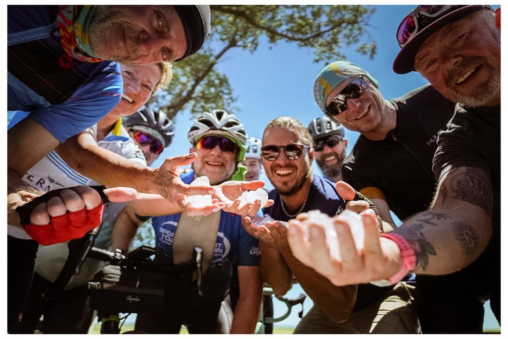
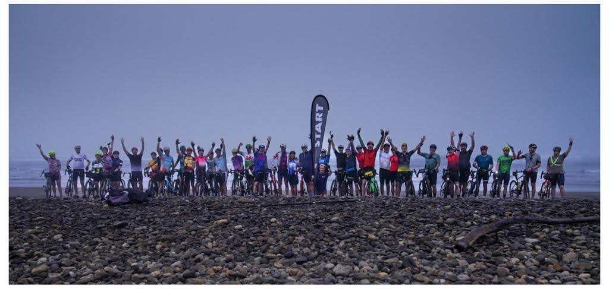
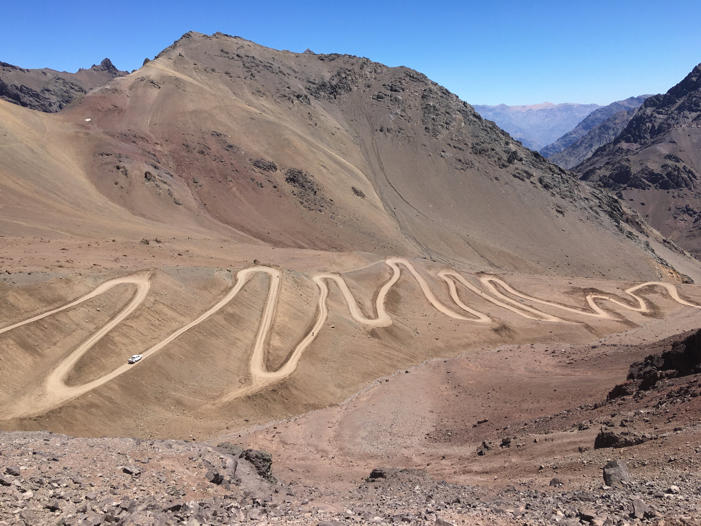
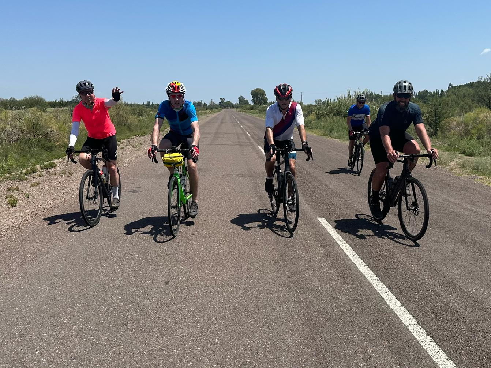
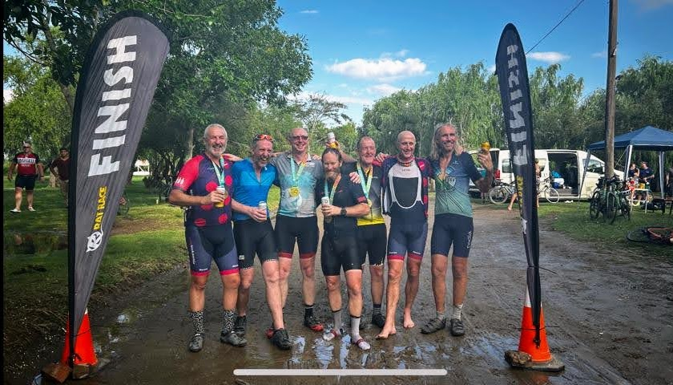
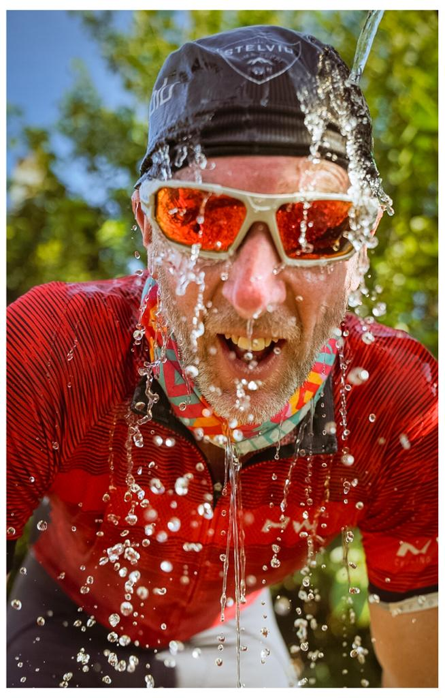

This is a brief report from my ride across South America from Valparaiso on Chile’s Pacific coast to the
Atlantic at Buenos Aires (Argentina) in February. 1,500km ridden across 9 days up and over the
Andes and across the open and flat Argentinian pampa from coast to coast. Baking sunshine, crazy
headwinds and tropical downpours. A really great trip and so much more than I’d ever attempted or
achieved on two wheels.

The ride was the second running of RatRace’s TransAndean event, and I’d signed up on the basis of a
picture of an amazing section of hairpins in the Andes (Los Caracoles), and the challenge of back to
back long days of riding to cross a continent. Most of it on paved roads, but at least one section of
gravel promised across the Andes.

None of it disappointed. I joined 41 other people who also just wanted to ride their bikes all day;
leaving a Pacific coast shrouded in sea mist for a first day whose ride profile, and temperature was
only ever up.

Day 2 was summit day, with 2,400m ascended in just 42km including the brilliant Los Caracoles
hairpins which were made even better by roadworks which left us with long sections free of traffic.
The highest section of the road to Argentina is by a tunnel that is closed to cycles, leaving us with a
stunning 9km of gravel switchbacks to the monument of Cristo Redentor de los Andes. From the top
at 3,800m elevation, it was downhill all the way to the Atlantic – surely!

Day 3 along the Mendoza River was most certainly a day of down – all 160km of it, past coloured
cliffs and canyons, and then out into La Pampa. Day 4 onwards, from the Malbec and steak city of
Mendoza, were all about getting done what we needed to do to cross the pampa and reach the
coast in five days. Cue some excellent days of rolling along across wide flat landscapes – tucked in
and pulling on the front of some great bike trains, or sat up and admiring both the far reaching views
as well as condors, parrots and flamingos. 

The brilliant support throughout from the RatRace crew kept
us going with regular feed stations and impromptu stops for ice and water on the hotter days.
Some storms as we neared Buenos Aires provided the novel experience of riding in warm rain,
before reaching the end of the road, the coast, beers, tears, BBQ and party. 

A really excellent trip - and everything I’d wanted it to be.

