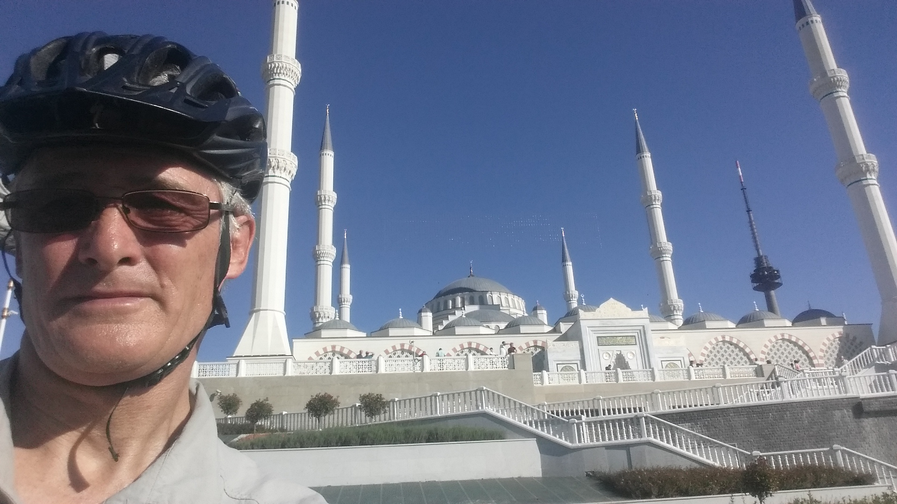

When I retired in 2017 I got the freedom to ride and train whenever I wanted, but getting a bit older meant that I was starting to slow down.  My motivation when racing had always been to chase faster times, and although a lot of 'more senior' riders continue to enjoy the challenge that racing brings, I began to think about other ways to enjoy my riding.  That's how I came to buy a Thorn Audax bike with full touring panniers and enough equipment/gear to complete my camping setup. 

When I started cycling 50 years ago, 'tourists' were considered by the racing fraternity to be second class cyclists.  With the advent of bikepacking though, touring is less frowned upon.  Having given it a go, I found that the experience of being able to spend a week or so just focussed on riding and exploring new areas, was a revelation.  

The idea started to develop that I could turn touring into a different type of cycling challenge. I felt that I'd love to take on a bigger adventure. I wanted to ride from my front door and travel to somewhere more exotic, and feel that I'd achieved something special.  I'm lucky that my wife understood this and fully supported me (or perhaps, now that I was retired, she needed a break from and having me around all of the time!).

In Michelle Lee's interview with Steve Phillips, both fellow RDFCC adventure cyclists (posted on the club website last year), she quoted his motto of 'Go light, Go alone, Go fast, Go far'.  Also, guided by his army background, Steve referred to the benefits of getting used to living and travelling without certainty.  I felt happy to adopt the go far and go alone principles, but after a career as a nuclear engineer, the need to analyse and prepare for all eventualities is deeply ingrained, which inevitably meant that I felt the need to travel heavier and slower.

For a long tour, this meant that fully loaded, including carrying cooking, camping and sleeping kit, a few spares, tools, locks, and maintenance gear, a fleece, a pair of trousers, 2 short sleeve cycling tops, 2 long sleeve shirts for protection from the sun when riding, 1 teeshirt a waterproof top, 3 pairs of cycling and 1 pair of swimming shorts, towel, wash kit, sunscreen etc., a power bank, charger and cables, a head torch, some food and a water treatment filter and purification tablets, and enough water to get through areas without a safe supply (7.5 litres), plus a few other bits and pieces, the bike and equipment weighed 51kg.  Whilst not as nimble as a fast bikepacking setup, it gives a smooth relaxing feel (although fast twisty steep descents can be a little less relaxing, particularly given the use of rim brakes!).  

Like most people, I enjoy cycling in the sunshine and by the sea.  So, in 2019, I decided that a trip across Europe to Asia and back, taking in the Mediterranean, Adriatic, Aegean and Black Seas, sounded ideal.  The 11000km ride would take me through famous places, and through some countries that I wasn't even sure where they were before planning the trip.

The route took me down to Plymouth to catch the ferry to Santander, across Spain and the Pyrenees though Andorra, around the Med and Adriatic coasts through France, Monaco, Italy, Slovenia, Croatia, Boznia and Herzegovina, Montenegro, across country through Albania, Macedonia, Serbia and Greece to the Agean, and via Bulgaria and the Black Sea, to Turkey, where I crossed the Bosphorus at Istanbul into Asia.  On the return route, the first part of the journey was similar, but I took a more northerly route through Italy, and then crossed the Alps via the Col du Galibier, went up over the Massif Central and through the Dordogne up to northern France and the ferry back to Plymouth.

Planning the route, I consciously went around the Med on the way out so that I could keep it on my right.  Due to the drive on the right system on the continent, this kept me closest to the sea and the views. Being on a bike also means that, I could stop and look at in places where motor vehicles couldn't stop.  

I set off at the beginning of May to see what the world had to offer a single unsupported traveller.  Being on a bike, and combining a mixture of camping and staying in local hotels, shopping in small shops and eating in small cafes and restaurants, allowed me to meet many interesting people and sample their way of life.  This way of travelling allows you to get much more immersed in many different cultures than normal holidaymakers could ever hope to do.

The sights along the way ranged from the home of luxury, Monaco, [where, standing on the Grand Prix start line the day after the race, with one foot clipped in taking in the atmosphere, I leant over too far in the wrong direction and fell over in front of the crowd; and also where I was almost arrested when I accidentally cycled into tunnels out of the Principality on what turned out to be an Autoroute, and was escorted though the reminder of the 1km long tunnels by traffic police]; to poor rural areas in Macedonia and Albania (where I was chased by a old man dressed in tattered clothing and riding a old, dilapidated moped who, in very broken English, invited me to have tea and stay at his house where his daughter could translate.  Despite some misgivings, when we passed his house it looked respectable, so I stopped and went in.  It turned out that he was the Albanian Minister for Food, (which I confirmed by a Google search, where he was pictured in his business attire of smart suit and well groomed hair). Apparently he liked to hunt down and chat with foreign touring cyclists).  I went past bleak communist grey concrete housing blocks of Bulgaria; through the spectacular Alpine mountains and along beautiful sun drenched beaches, and enjoyed the eastern Mosques with the evocative sounds of Imams calling the faithful to prayer.

In addition to seeing the sights and meeting people, cycling also gets you much closer to the ecology, the smells and the climatic conditions of a country.  The weather ranged from freezing conditions in the Pyranees, to temperatures in the mid 40's further east, through to very heavy rain and strong winds. The rain was so hard in Trieste that I stopped for two days until the weather front moved on.  I spent a couple of hours of those two days in a torrential downpour waiting for the finish of a pro race, hoping to see Mark Cavendish unleash his sprint.  Unfortunately, without me knowing, the rain had also proved too much for him, and he had climbed off with an hour to go.

I would usually aim for an average of 120km per day, and take a day off every week or so to visit interesting places, or just to catch up with domestic jobs.  I also took 2 or 3 days off when my wife came to meet up with me in Venice, Istanbul and at Lake Garda. These were great breaks, although it took a little time to settle back in to being on my own again in countries where I couldn't communicate very well.  

The biggest shock to the system was on the return ferry though, where I was suddenly surrounded by a lot of English conversations. It almost felt claustrophobic.  I was also disappointed to note when I got back onto British roads, that British drivers were the worst that I experienced on my whole trip.  

On getting home I felt that I had achieved something significant in my life. I had got the wanderlust out of my system, and could now settle down to a more normal life.

Until ....... 
(Part 2 to come soon)
