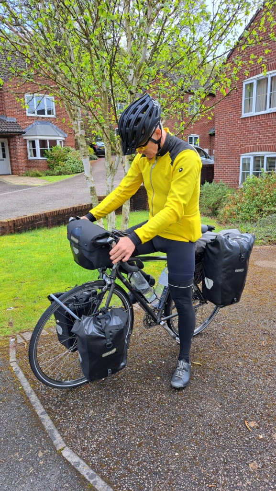
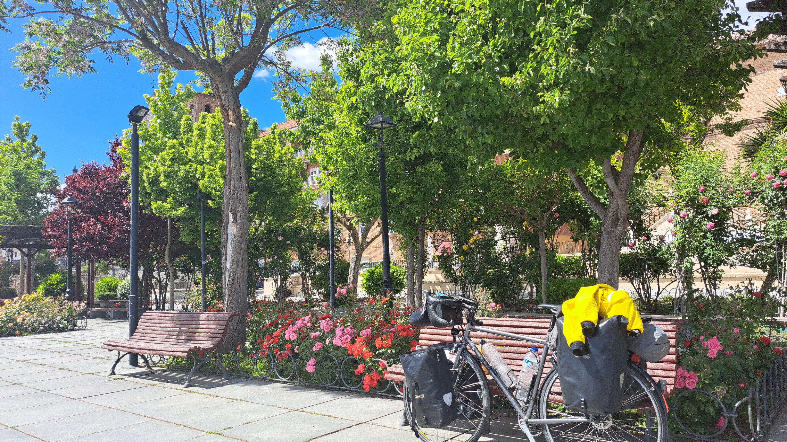
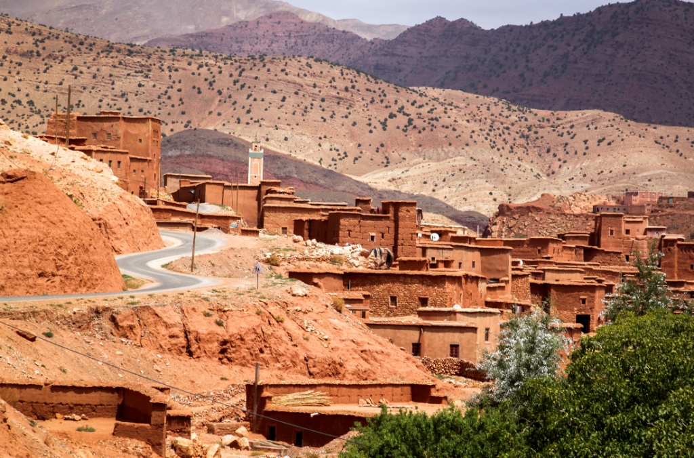
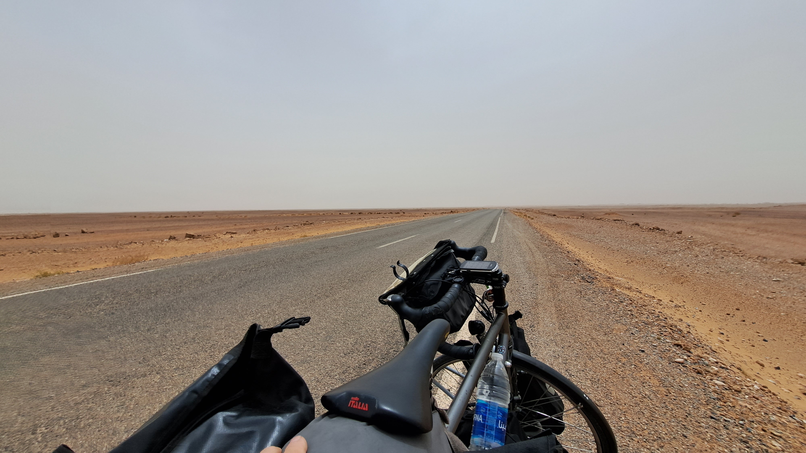
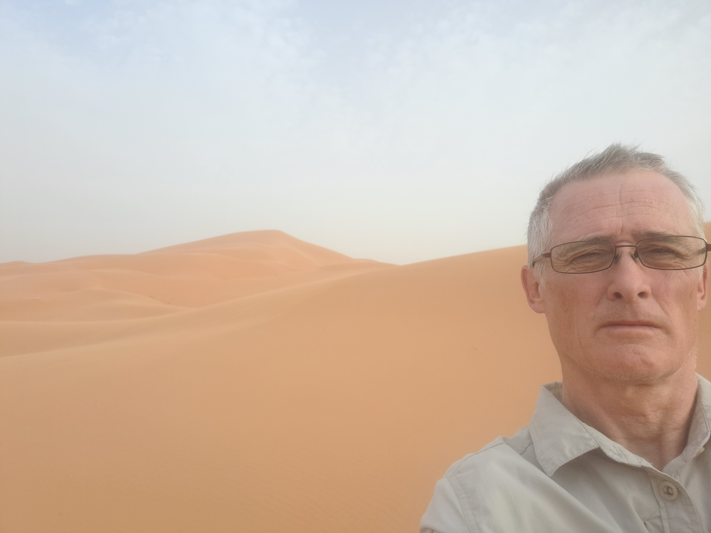

Having done Asia, wouldn't it be a interesting challenge to go to Africa
and see the Sahara Desert?

So, in 2023, I planned to ride to the desert and back.
Having identified the equipment that I would need during my previous
trip, the main preparation this time involved having numerous
vaccinations and finding an interesting route.
I again planned to ride to Plymouth to take the ferry to Santander, then go
down through the centre of Spain, cross the Straights of Gibralter into
Morocco, winding my way down to the Sahara via the Atlas Mountains,
returning through Marrakech, up the Moroccan and the Mediterranean
coasts of Spain and France, over Mt Ventoux and back to Santander
through the northern side of the Pyrenees. This was a 8000km trip, again
aiming to do 120km a day and having one day per week off.

I booked the ferry for the middle of May, based on the hope that the UK
weather should be ok by then, and to avoid the worst of the heat in the
desert. I actually set off on the 17th May, to face ten days of heavy rain
and flooding. At one point, the water on one flooded section of road
came above the bottom bracket and wheel hubs.

The first few days in Spain went down to 3 or 4 degrees at night, and
didn't get above 8 degrees during the night. By the time I got to
Salamanca though, I had ridden into summer. The sun was shining, the
blossom was out, and the temperature was up to 30 degrees. However, by
the time I got to Seville, the flood water in the UK had managed to
destroy the rear wheel bearings, which had to be replaced at a Shimano
Service Centre.

My wife joined me on the south coast of Spain for a couple of days. We
spent a day in Gibraltar and took a trip across to Tangier in Morocco to
get our first taste of Africa.

When I crossed to Tangier with my bike to continue my trip, the border
guards only seemed to want to know if I was carrying a drone. I was also
asked this at some of the many police road block check points around the
country.

I decided to mainly stay in small riads when I was in Morocco because
they generally only cost £5-£10 per night, and because there were
problems with packs of rabid dogs in most places. Even though I had
been vaccinated, this only extended the period in which you had to get a
hospital from 2 days to 5-7 days. The riads were great places to meet
people and get a feel for the genuine Morocco.

As I progressed down though the country I got to enjoy the anarchic style
of driving in the cities, the calls to prayer and the increasingly 'deserty'
terrain with small ramshakle towns and mud brick villages. I can
recommend the blue town of Chefchaouen and the ancient city of Fes,
which was more genuine and less 'agressive' than Marrakech. I was also
becoming a fan of the local cuisine of Tagines and barbequed meats, and
had plenty of fresh mint tea (taking care only to eat piping hot food and
drinks and sealed bottles of water and coke). Where hygiene was a bit
suspect, I resorted to eating my dehydrated meals.

The Atlas Mountains and uplands were barren (in a nice way), very cold
and windy, many of the roads were unsurfaced, and the passes were
spectacular. Despite the distinctive scenery, it was nice to get back down
to the warmer plains and into the desert. The desert area was mainly vast,
very flat plains, stretching as far as the horizon, made up of grey grit with
small, up to fist sized, stones. It felt very lunar, until the dunes, that most
people (including myself) think of as 'the desert', finally appeared.

Reaching the dunes, and riding on until the road ran out, was quite an
experience from four perspectives. Firstly, I had the opportunity to ride
in a real sandstorm; secondly, there were camels, and only occasional
mud and straw built buildings; thirdly, it was extremely easy to quickly
become disoriented when walking out into the dunes; fourthly, I came
down with Morocco belly for 5 days. As a result, once I was confident
enough to travel without access to a toilet, I had to take a bus from the

desert to Marrakech. Whilst the temperatures in the desert were in the
high 40s, it was a dry heat, and getting off the bus into the humid 40
degrees of Marrakesh felt a lot hotter.

The trip almost ended here. My wife rang to say that she had broken her
ankle. Even though she was alone at home, she insisted that I carry on.
The ride across to, and up the coast had a much more western feel to it,
outside of the old town centres.

Once back in Spain all went well, apart from one day of really busy major
roads on the southern costas, which kept banning cyclists without
offering an alternative route (my worst ever day cycling), and needing a
new bottom bracket fitting (another legacy of the UK flooding). I had a
surprisingly pleasant couple of days in Benidorm, and my wife managed
to get out to see me in Barcelona.

Moving into France, and getting towards Mt Ventoux, a piece of my rear
hub flange broke off where the spokes were attached, converting the rear
wheel into a floppy mattress, I had no option but to get a new wheel,
which because of French national holidays, took nearly a week. This
delay, and the lower strength of the new wheel, meant that I had to miss
out Mt Ventoux, and ride very carefully, with long days, all the way back
to Santander to catch my ferry in Spain.

Having had to miss the mountain, and take a bus in Morocco, I felt when
I got home that I hadn't quite succeeded with my challenge. In retrospect
though, I realise that I getting through the difficulties when I was
travelling solo was actually a success.

Over the two trips, I have been to places, seen things, met people, and
eaten food that most people would never hope to do. I've seen mountains,
seas, desert, amazing historical towns and architecture, wild monkeys,
tortoises, camels, exotic birds, mosquitoes and snakes. I have
experienced extreme high temperatures, freezing conditions, torrential
rain, gale force winds, sandstorms and glorious warm sunny days. I have
been chased by dogs and had stones thrown at me by groups of children. I
have been invited into peoples homes and lives - Without a bike, I
would never have done this.