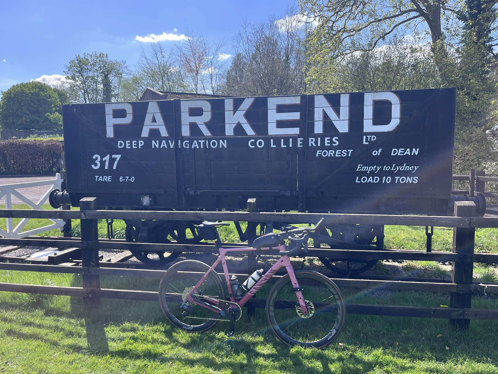
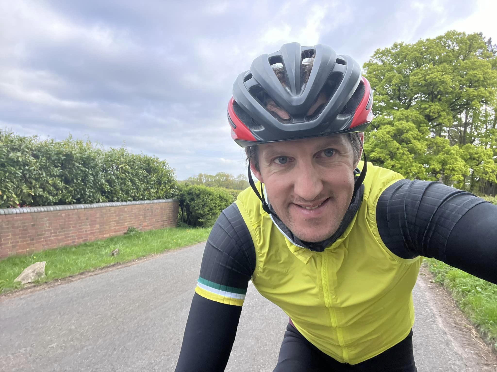
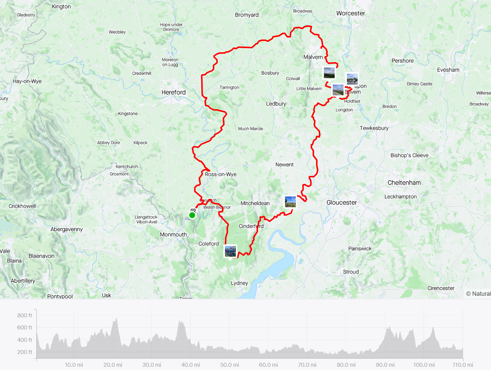

This was a solo attempt for me today so left home at Symonds Yat at 6am as it is daylight now, and joined Matt Neale’s route at Goodrich. A chilly 4c for the off so layered up! 
Some very old and tiny wet lanes greeted me around the Wye heading north before leaving the river, still North, and then swinging East, then South for breakfast of Double Sausage and Egg McMuffin meal (calories of champions!) at Malvern. 

The sun showed its face for the ride to Upton Upon Severn and though the lanes of south Worcestershire and back into Gloucestershire and the forest. Some nice lanes (and some rutted, wet and loose ones as well) before the climb back into the trees Littledean/Mallards/Parkend. 

After a quick photo, back on the bike past Cannop, Lydbrook, down to the Wye, Goodrich and then the final climb back home on the Doward (who’s idea was it to move to the top of a steep hill???)

Total time for the 100 was under 7hrs, and moving time for the 110 miles of the day also under 7hrs, with half and hour faff time. 

A great route if anyone else fancies it later in the season… Thanks to Matt for putting up the route

