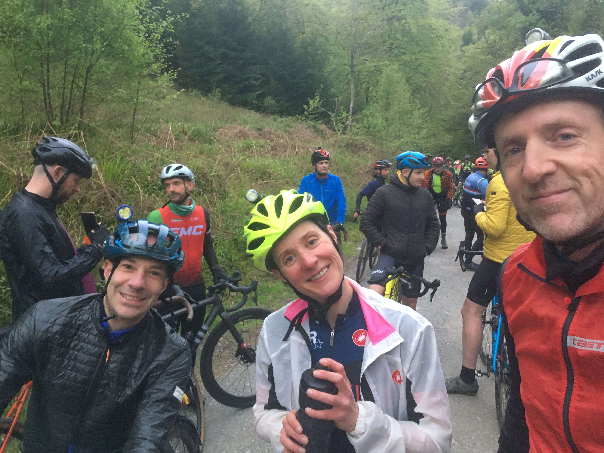
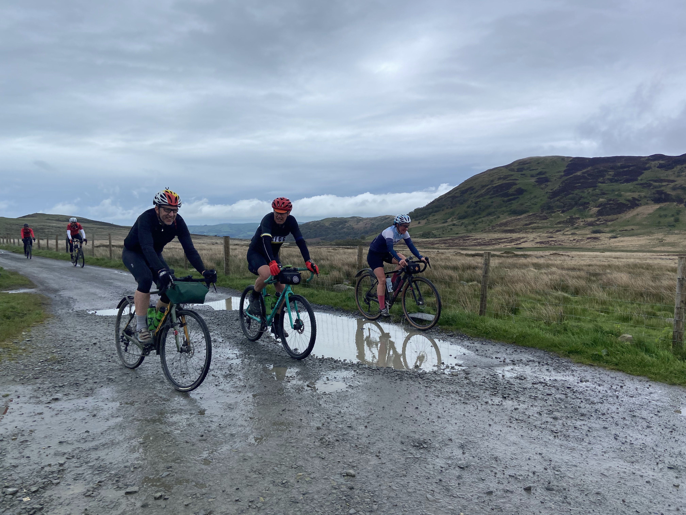
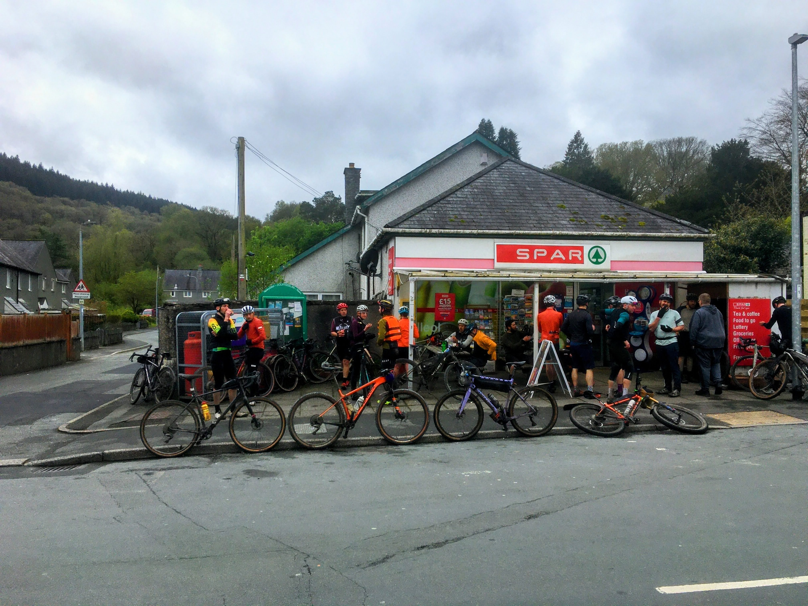
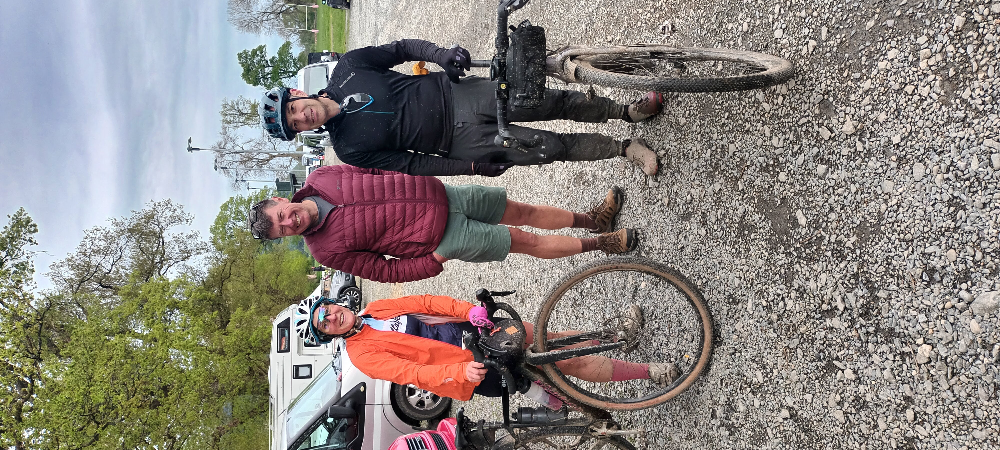

'It's brilliant, you'd love it' that is all one cyclist needs to mutter to another cyclist to put red flag to the bull. Jon recommended the event having done it before and their multi day road event, so a few of us got online and booked ourselves in.

The rally takes places near Llanwrst and Betws-y-coed in the Eryri region (Snowdonia), it kicks off with a night race of about 11k (1 hour race), on the Friday and then the Saturday is the big day out with timed race sections.

After a long drive through Wales in my 80's camper I arrived (never take that for granted in an old dub) at the rugby ground with camping and the event set up. Parked up near the guys and started prepping the bike that I decided I wouldn't use to race that night. This tactic worked well, no chance to get any race nerves, as I spent the time just getting ready just incase I changed my mind, which of course I did. Dan, myself and Colin rode over to the start line, leaving Jon to celebrate his birthday in the mini festival atmosphere, with other half and friends around.

We and a few other stood, astride bikes in the growing darkness of the woods, a slight drizzle of rain, pumping house tunes and enough gravel gear on my fellow riders to make my inner geek seriously jealous. The tannoy kicked in, in the build up to the start of the event and shortly later we set off in groups of 10 or so. I absolutely loved the night race and as Dan pointed out afterwards, 'well, we have been practicing for the last 6 months' referring of course to our weekly club, night rides. 

The night race features some draggy if rather tasty evil climbs and then, unexpectedly, onto a long, exciting single track climb. I managed to politely squeeze past a few other riders and despite being in a bit of a queue, this drag was enlivening. Onto another tough fire road climb and to my delight we popped through a small gap onto a downhill single track. At this point, on a step down section, my pedal hit a tree stump and I went flying, not gracefully, over the handle bars and onto the soft moss. Rolling myself out of the way with Dan and myself both shouting 'rider down', I was back up and laughing at myself for the rest of the race. Dan and I finished together, Colin just behind, with Dan saying he'd been careful to save something for tomorrow and myself pretending the same, but slightly hoping I had.

The big day, a long roll out along the roads was actually a part I wasn't looking forward to, remembering the crazy tumble dryer effect of roll outs in road races, but this was different, gravel riders as a crowd do have a genuinely chilled vibe and the roll out was no different. A nice, chatty, warm up along the beautiful country lanes, before turning onto an absolutely brutal climb for stage 1. I made the mistake of getting going in full rain jacket, pheughhh hot, but I just didn't want to stop, the race bug taking hold or just the gradient making stopping too much like hard work. At the top the welcome relief of the next transition, through stunning mountain ranges, before the next, toughest stage of the day. 

A small sign by the track side, announces the start of 'stage 2' A long, absolutely brutal valley track through Eigiau to Cowlyd, the deepest lake in Wales. A gate climb and gladly Jon reassured us that was the toughest part of the day, which came as relief as my legs were already shot. Another 20k in along a simple road transition I suddenly went into cramp in the thigh,  perhaps a combination of the cold wind, dehydration from the drive and bumpy terrain, my leg wouldn't even turn and I stumble off onto the grass verge howling in pain. The guys stopped just a short wait away and a very kindly chap behind me, stopped and went into paramedic mode, he had me get my foot up onto saddle and told me to breath and relax...amazingly it worked and I managed to hobble to the spar in search of an isotonic drink. Upon over hearing my quest, another rider, a rugby guy in an enthusiastic, strong Welsh accent, keenly assured me that when this happens to their players they ply them with pickle (gherkin) water. Dan points to a jar of pickled onions, but no gerkins, so I reluctantly opt for the less interesting option, Lucozade sport. Not something I usually would drink, but I have to report it seems to have worked, along with salty crisps recommended by Colin and the cramp only slightly threatened for the rest of the day.

Gravel rally really is a battle of mind over matter at times and 100% better ridden with friends, the transitions at each point allow you to regroup and laugh at what you've just been through. And the day really did turn out to be about friends, as we rounded one of the later stages in the Penmancho area, I recognised a good friend back from my Surrey league days, Natalie, fixing a puncture, despite a quick chat on the first day I hadn't seen her again on the busy starts so this was a lucky moment and we stopped to wait. A fast fix and we were all off and rode out the rest of the day together, occasionally gapping each other, but always regrouping at the end of the stages. 

Back at the HQ, a burger van operated by the hardest working woman in wales and herself a Pan Celtic rider for the coming road event, was most riders lifeline as they rolled back in. Group photo's, hugs, weary showers, burger and beer, a most excellent day.

I have since tried a sip of Gerkin water!

