Photo - Kitty Dennis (@bluberrysmoothie_photos) and The Perfidious Albion (@theperfidiousalbion)

**Intro**

‘I’m never doing that again’ were the words I uttered at the end of the Wild West Country 2023. It had been a pretty gruelling 4 days and I was just glad for it to be finished. So what was I doing at the start of Wild West Country 2024? I have no idea, but I guess it was the thought that maybe I could do better this time….

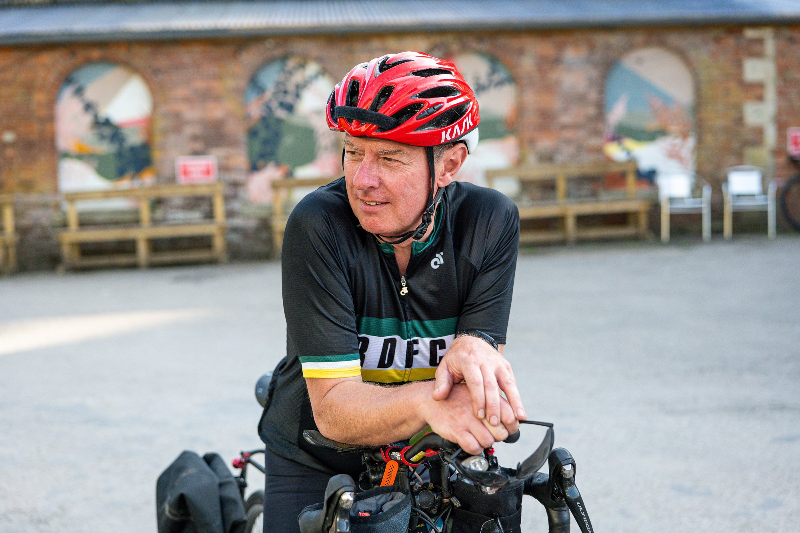
Photo - The Perfidious Albion (@theperfidiousalbion)

**Thursday**

The Wild West Country is a 530mile(837km) self supported ultra endurance race that takes in most of the west of England devised by Rob Gardiner. Rob seems to like hills, lots of them and the total climb for the race is 37,000ft(11,000m).

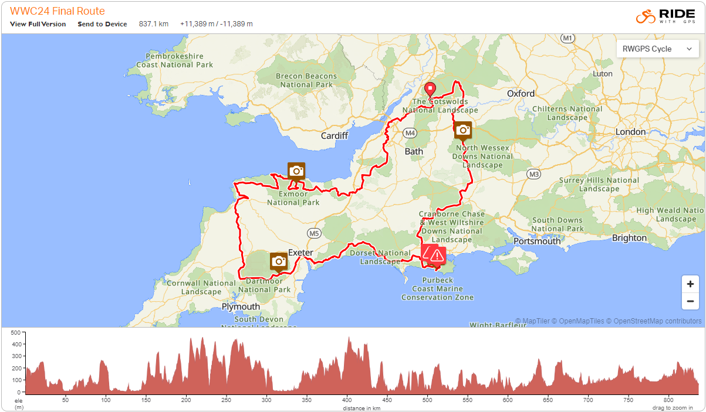

Registration was at The Bike Drop in Brinscombe near Stroud. Upon arrival I spotted a few familiar faces from last year plus a couple of fellow veterans from the Pan Celtic Race. A couple of these were not racing but were there as sponsors of the race promoting their bike brand Wendover Bikes. Chris and Sam thrust a beer into my hand. So much for the alcohol free weekend!

After a briefing from Rob we all departed to prepare for the start on Friday morning.

**Friday**

The morning started bright if a little chilly. After riding down to Brinscombe there was time for a few quick chats with fellow competitors and a coffee and cake from The Long Table. The start was at 9am with groups of five heading up the first climb of Brinscombe Hill at 2 minute intervals.

The going was initially easy as we dropped out of the Cotswolds, into the Severn Valley and on towards Bristol. Over the Clifton bridge and into the Mendips the sun really started to heat up causing a few of us to stop and find shade on one of the steeper climbs.

The descent into Cheddar Gorge was an early highlight. A resupply stop was taken as a bakery and Tesco express in Cheddar itself. The drinks bottles certainly needed refilling!

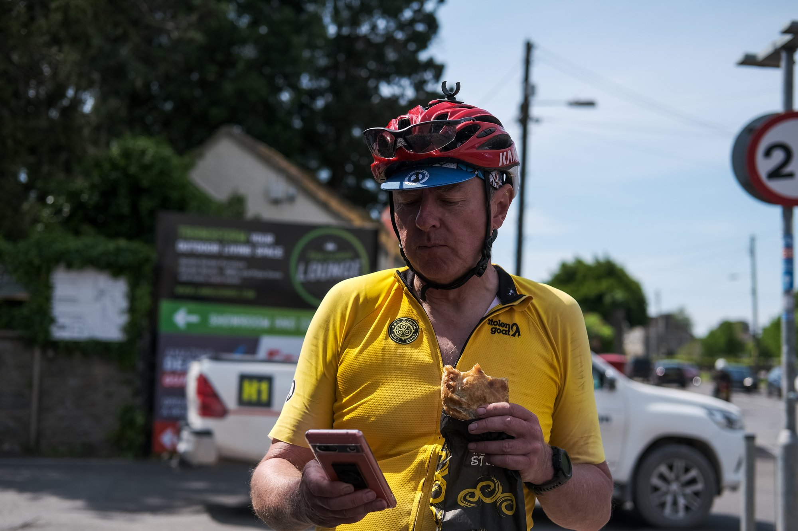
Photo - Nadia Shahanaz (@nadiashahanaz) and The Perfidious Albion (@theperfidiousalbion)

Onwards across the Somerset Levels and towards the looming Quantocks where the real climbing would start. Up and over to Crowcombe we then headed across to the fringes of Exmoor with plenty of short sharp climbs. The original plan was to get to Porlock before 10pm to catch the shop before it closed, but I quickly realised that wasn’t going to happen. Having accepted this state of affairs the next thing to do was to find some proper food. I was already struggling to get food down partly because of the heat and partly because I think I had eaten too much bread and pastry. I was riding with Jack Tyler at the time and so we hit the first pub we came across. No booking, no food, on to the next one. Luckily the Valiant Soldier were much more accomodating and we had ham egg and chips within 5 minutes (along with a Guiness, well it is food sort of!) 

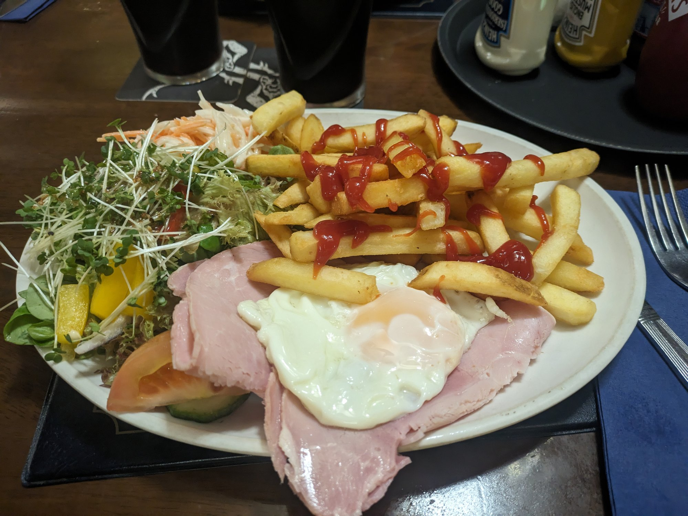

A little more of the rolling stuff then we hit the big one, Dunkery, which we do twice! I decided to walk most of this one to save the legs and knees for what was to come. The first accent ended with checkpoint 1. Jacket now on as it was getting cold, off we went down the hill, around the back and up the other side. Having reached the top we were accosted by someone leaping around with a head torch shouting ‘Look, it’s the Northern Lights!’ This was Kitty, one of the organisers of the race pointing out a spectacle we would have missed otherwise!

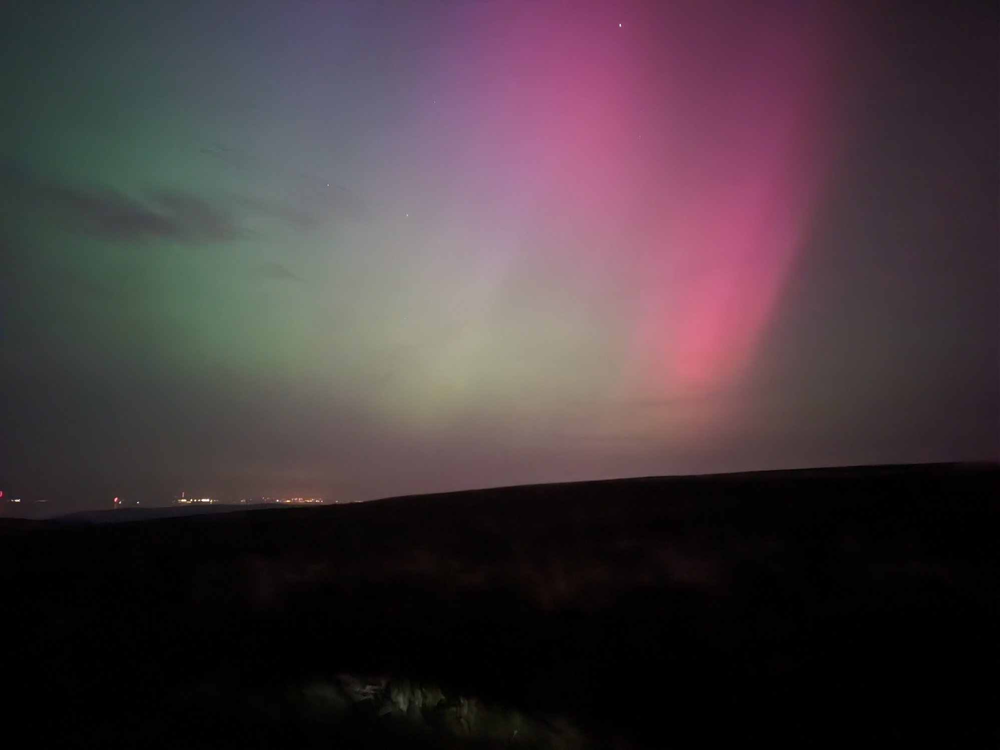

The steep descent into Porlock is one where you certainly glad of good brakes. It was then through the town and up the toll road. The main road is an option, but the toll road is beautiful even now it’s almost completely dark. On reaching the top I found somewhere to pitch the tent just off the road. Jack carried to a church he had eyed up as a bivvy spot. Although I was very tired I couldn’t get to sleep which was pretty annoying!

**Saturday**

Saturday started with a gorgeous sunrise over the sea although the warmth was short lived as I dropped into a cold and misty Doone Valley. As I climbed back out of the valley I was caught by ‘Dot’ Perkins and we rode together for a few miles through Lynmouth and onto Exmoor again.

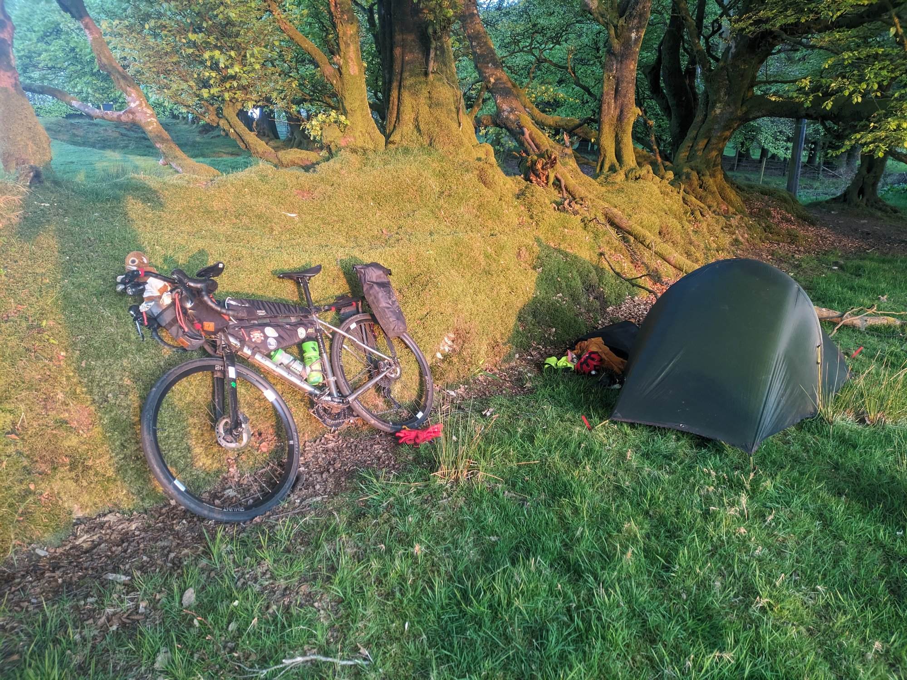

Back on my own again (except for my mascot Gary of course!) I traversed across towards Wollacombe. I was still not eating well and did my best to force down a warm pasty from a very small shop in Challacombe. On reaching Woolacombe I had decided that I would carry on as far as Exeter and get the train home. I really wasn’t enjoying myself and was feeling pretty rough due to the eating issues. I had a leisurely coffee and some porridge and started to feel a little better. I decided to try and avoid bread as much as possible and started on a diet of milky drinks and yogurt!

The climb out of Woolacombe is pretty nasty but once at the top it’s pretty rolling and downhill down to the Tarka Trail, a nice respite from the hills for 16 miles! I was still struggling with lack of food and sleep so had a couple of breaks along here. I was still intending to scratch in Exeter, such was my lack of enjoyment.

On down to Tavistock it was getting pretty hot again. A quick stop at the Co-Op for more yogurt and drinks, I met up with a few others and we all set off to tackle Dartmoor pretty much together but I was soon dropped. Luckily the temperature was now falling again which made the climbs bearable (just!). Heading on towards Haytor and checkpoint 2 it was getting dark. Looks like most people had missed the northern lights the previous night as now the roads across the moor were filling up with hundreds of cars. It was like Piccadilly Circus up there! Heading down off the moor to Bovey Tracey the road was full from top to bottom with people trying to get onto the moor. I doubt they all made it!

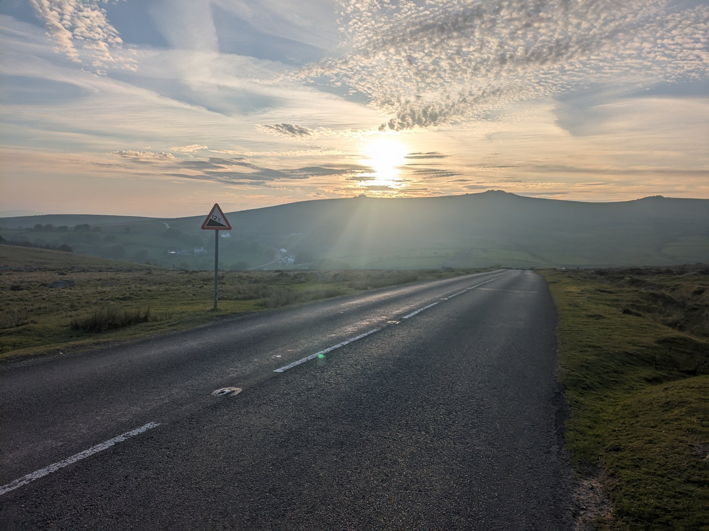

Three of us gathered at Dominos in Bovey Tracey for a late night snack of a large pizza (one each of course!) I managed to eat half which was a pretty good result. The left overs were stuffed into a smaller box and strapped to my rear bag before the climb up to Haldon Forest where I intended to camp. I set my alarm for 6:30 and got a really good night’s sleep.

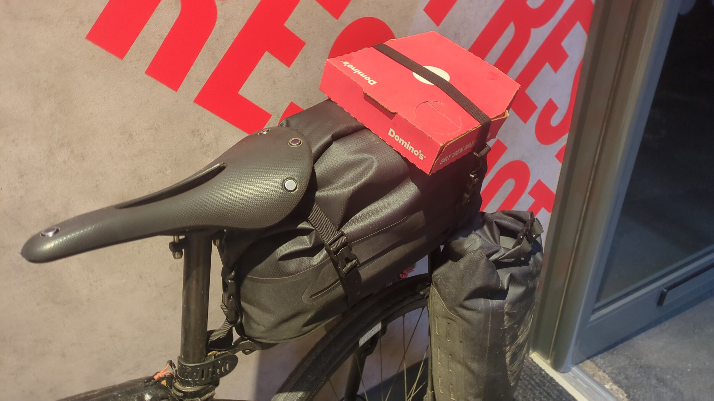

**Sunday**

Another bright morning welcomed me as I got out of the tent feeling well rested. I didn’t even give a thought to scratching as I headed downhill into Exeter. I had completely forgotten about it!

On though Exeter, it was a lovely Sunday morning with lots of dog walkers and runners about. On the way out of the city I spotted a petrol station and thought coffee! Mick Tompkinson was already there and we ended up riding together on and off for the rest of the race. Mick is another Pan Celtic veteran so there was a lot of chat about this year's upcoming race!

On towards Sidmouth and it was heating up again. Mick and I decided to try and find a proper breakfast to give us some energy for the steep climb out of the town. On the climb I decided to walk again. No point in killing the knees when it’s faster walking than riding.

Most of the big climbs were now behind us and the terrain was much more rolling as we headed towards Dorset. I left Mick resupplying in Bridport while I carried on towards checkpoint 3 at Kimmeridge Bay. The sea mist was now coming in and it was getting pretty cold at times. Checkpoint 3 done, I headed on towards Wareham with my heart set on chips and curry sauce! Chips secured I sat down to eat them to find they were the worst I had ever tasted and I struggled even to eat half of them. What a disappointment! 

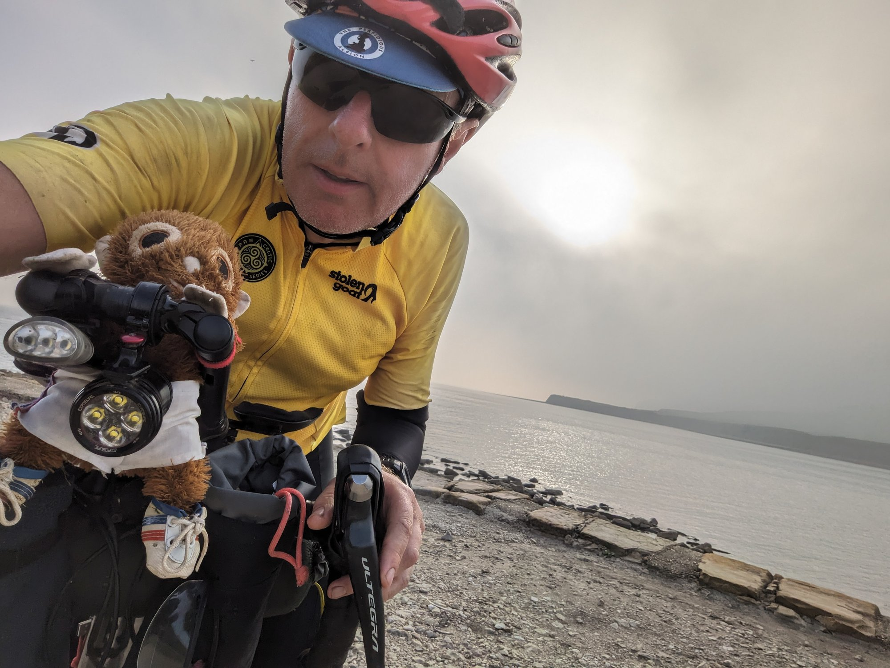

While trying to find a toilet Mick spotted me and called me into the Italian restaurant he had found. He was sitting there with a lovely cold looking pint of Peroni. How could I resist! Thought I might as well join him with a lasagne as the chips had been so bad. Another pint was secured before we headed back into the night with the idea of doing another 40 miles. That plan went out of the window when we both started feeling very tired (it wasn’t the beer, honest!) I knew of a good camp/bivvy spot at Oakford Fitzpaine so we headed there but not before we had done another climb. It was a pretty windy night but I think I got a reasonable sleep.

**Monday**

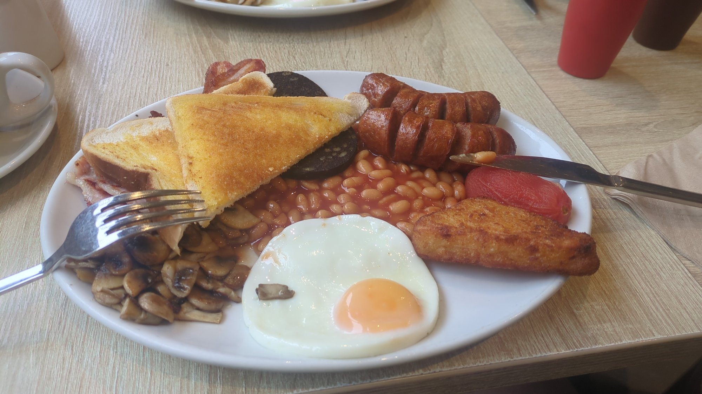

The start on Monday was slow. The legs just didn’t want to move and of course, there was another hill to climb up to Compton Abbas airfield. At least after that there was a nice downhill for a while. Mick and I were desperate for food but nothing was open until we got to Wilton. We stumbled into the first cafe we saw and what a find, the breakfast was amazing and the young lads manning the place couldn’t have been more helpful.

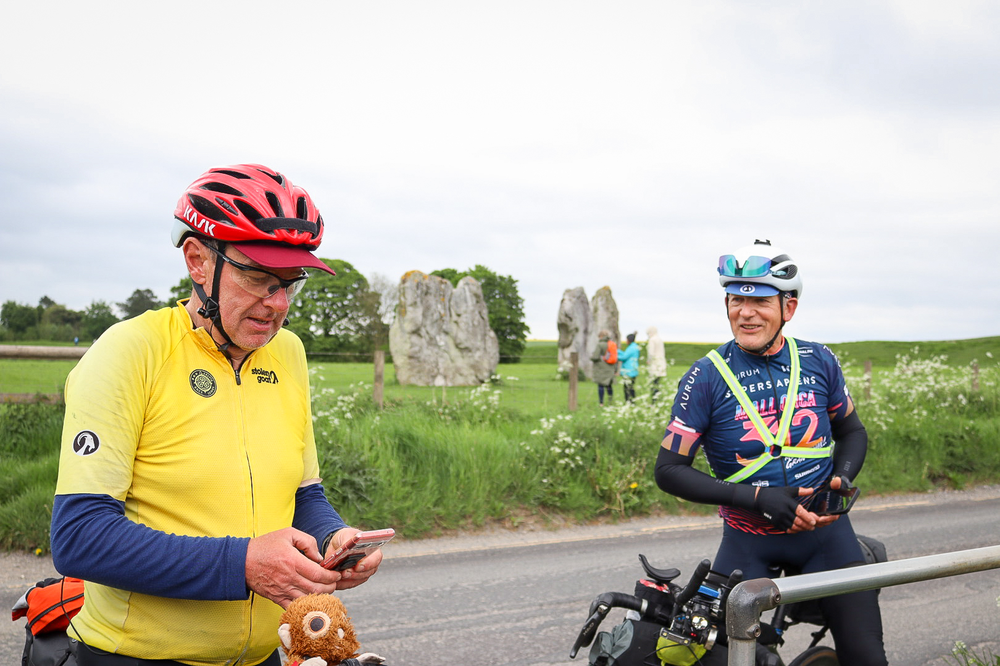
Photo - Kitty Dennis (@bluberrysmoothie_photos) and The Perfidious Albion (@theperfidiousalbion)

Now for the final push north to checkpoint 4 at Avebury and then into the Cotswolds. The stones were reached around lunchtime but the last thirty odd miles to the finish seemed to take forever. This wasn’t helped by my rear Tailfin bag launching itself into my rear wheel and taking out three spokes. I luckily had that number of spares with me and a trained mechanic in the form of Mick to help with the repairs. Unbelievably we were on our way in under an hour with a very wobbly but rideable wheel. Of course it then started raining and the next couple of hours giving my new Albion rain jacket a good test!

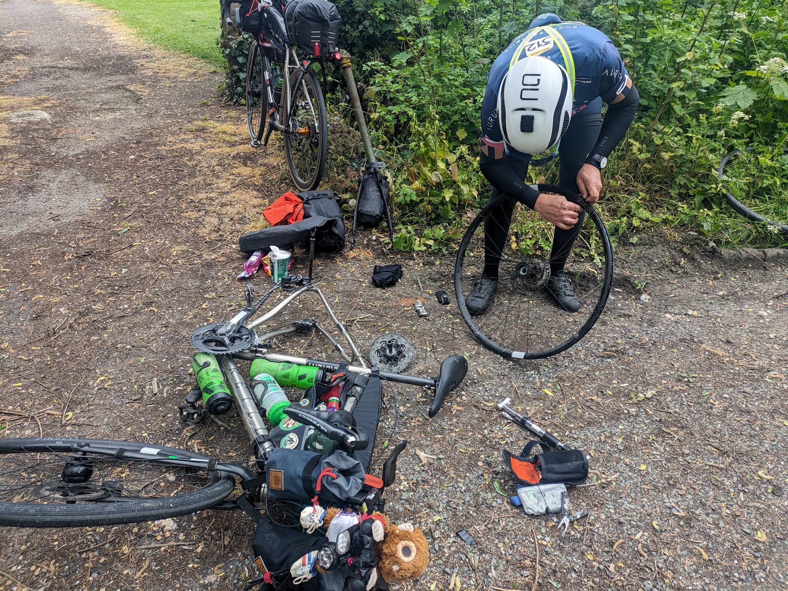

Finally we made it down the hill and into Brinscombe, very tired but happy I hadn’t scratched.

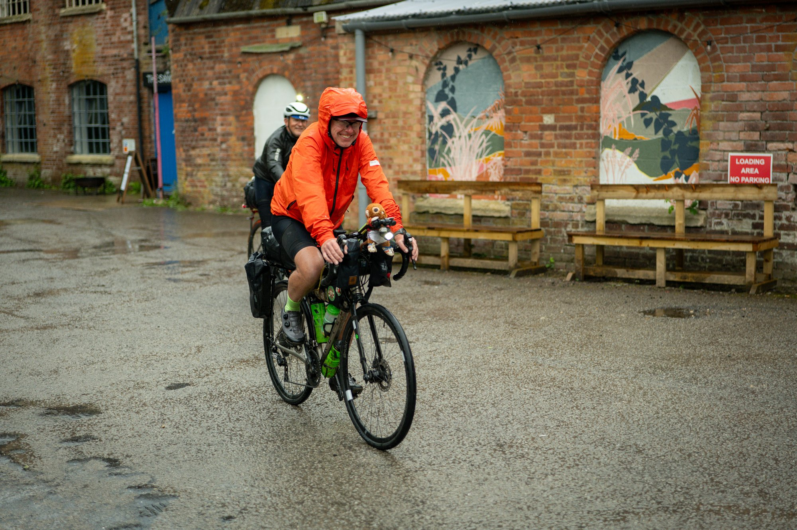
Photo - The Perfidious Albion (@theperfidiousalbion)

‘I’m not doing that again!’ I said before heading to the pub. We’ll see…..

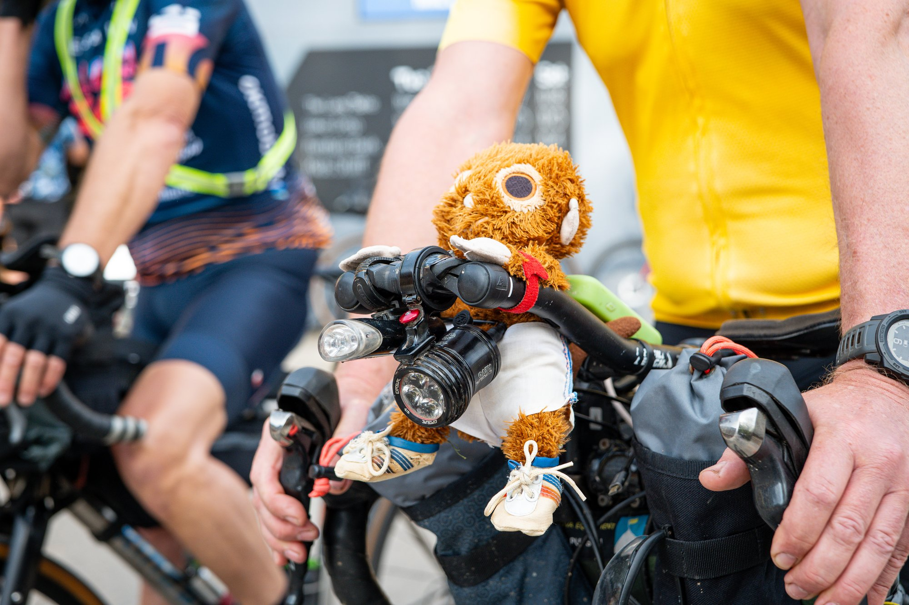
Photo - The Perfidious Albion (@theperfidiousalbion)
