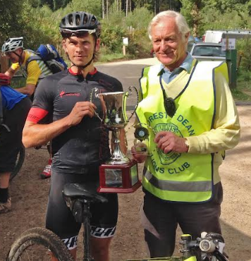

This year the Wild Boar Chase is Sunday 1st Sept, and as in every year RDFCC have provided the Lions with the route - this years more gravelly than ever. The Full route is just over 40 miles using gravel in the Forest and short road and lane sections to take the route over to the Wye. Ideal for gravel bikes, the only challenge is the Rookery Lane descent to Newnham, which Chairman happily rides, but can be bypassed.

The WBC route has evolved over the last 12 years - the initial routes were aimed at MTB riders and included Dowies! The MTB Marathon format was more popular back then.

RDFCC have been involved in MTB events for a long time. Old timers remember events in the 1990s and in 2006 we put on the first “Enduro” XC race. Well before any formal routes had been constructed in Sallow Vallets. The format was 4x10 mile laps and the pace was hard enough to attract serious riders such as Liam Killeen - 5x National Champ and Olympian.

The Club staged a couple more but struggled (as ever) to find the marshals/bandwidth and thankfully the Lions stepped in. The “Enduro” was run for 10 years until numbers dropped off - too full-on for your average rider! The WBC has proved much more popular with over 8000 riders in the 11 events raising many thousands for the Lions to help local causes. Our smart trainers were purchased with the help of the Lions.

To find out more and to enter please click the link below:-

<a href="https://www.fodmbe.org.uk/" target="_blank">https://www.fodmbe.org.uk/</a>