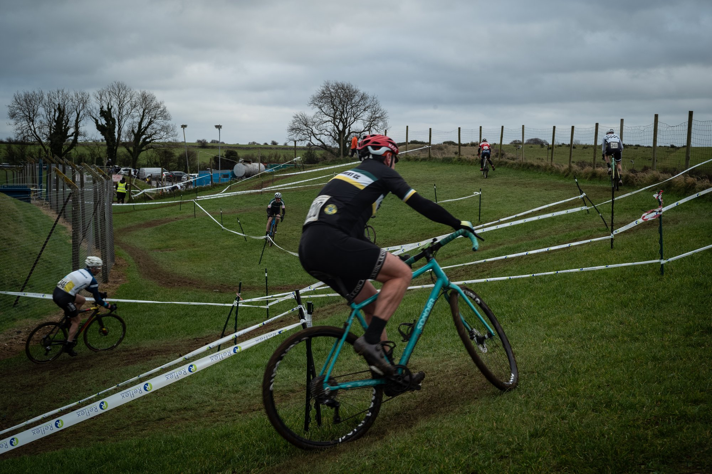
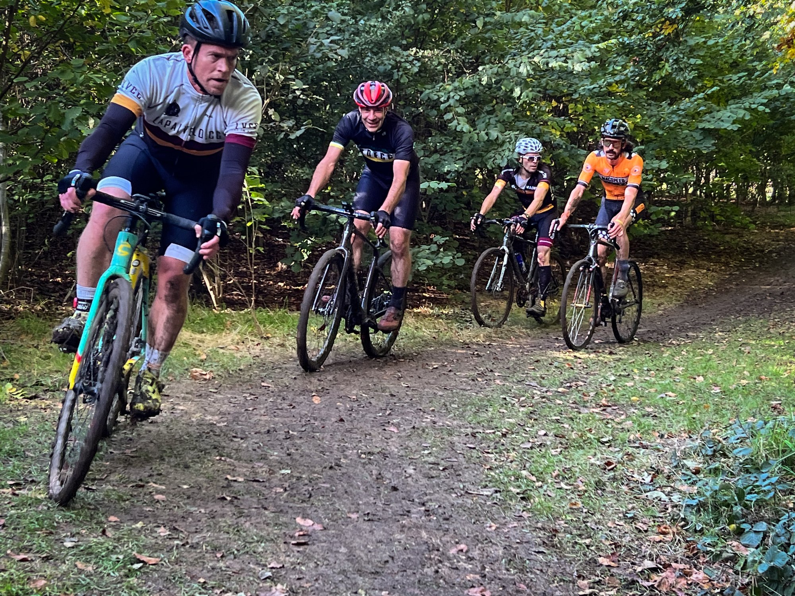

We are excited to announce that RDFCC will host a British Cycling affiliated cyclocross race which will be one round in the Western Cyclocross League’s upcoming winter season. The action will take place on Sunday 19th January 2025 at the undulating Angus Buchanan VC Recreation Ground in Coleford, Forest of Dean.

The site is well provisioned with parking, a clubhouse building which has proper toilets, and a kitchen which will be selling hot drinks and food to keep racers going. It’s also close to Coleford town which has all the amenities that visitors may need when they visit.

We plan to create a course for kids that will have manageable features, twists and turns, and will be great fun! For the adults we promise a mix of speed, technical obstacles, off-camber terrain…and mud!

We’re seeking volunteers to help with event preparation, and on the day. We’re also seeking sponsorship to enable us to make the event as memorable as possible for those attending. If you think you can help, get in touch with us using the contact form.

Finally, thanks go to the Angus Buchanan Trust who have kindly agreed the use of their grounds, Coleford Bowling Club for use of their clubhouse, the Western League Committee for their planning guidance, and to British Cycling for event homologation.

We can’t wait to see you there!
CROSS IS COMING

[westerncx.net](https://westerncx.net/)

[www.britishcycling.org](https://www.britishcycling.org.uk/events/details/307307/Western-Cyclo-Cross-League-Round-9---Forest-of-Dean---Winter-20242025-Season)

[https://www.angusbuchananvcrecreationground.co.uk](www.angusbuchananvcrecreationground.co.uk)
