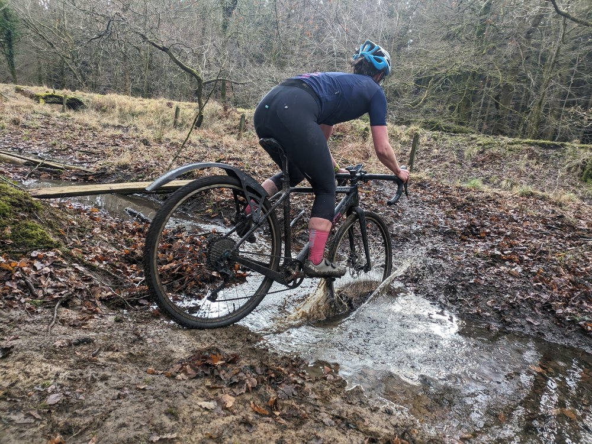
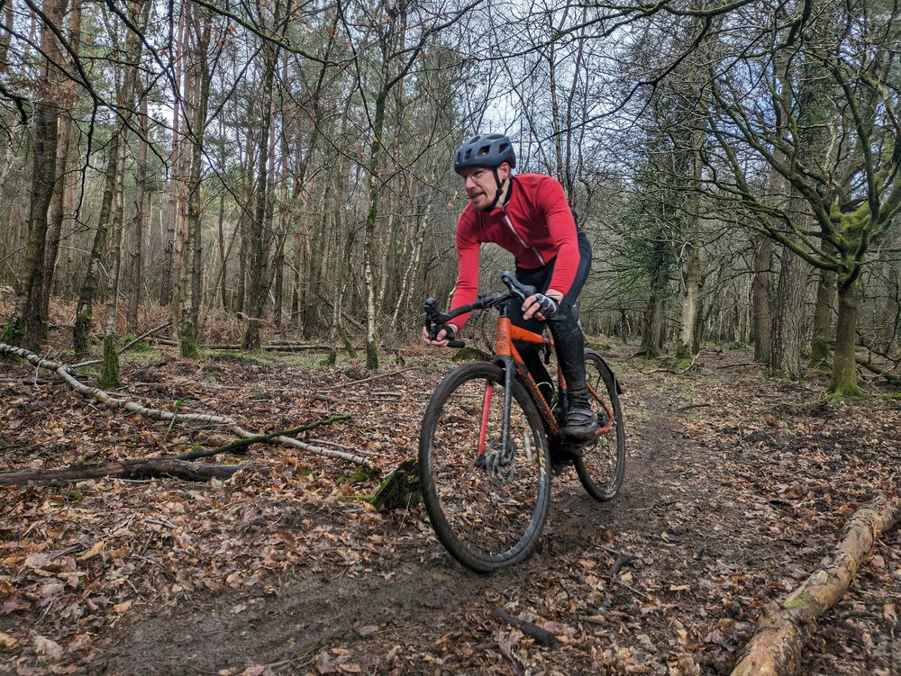
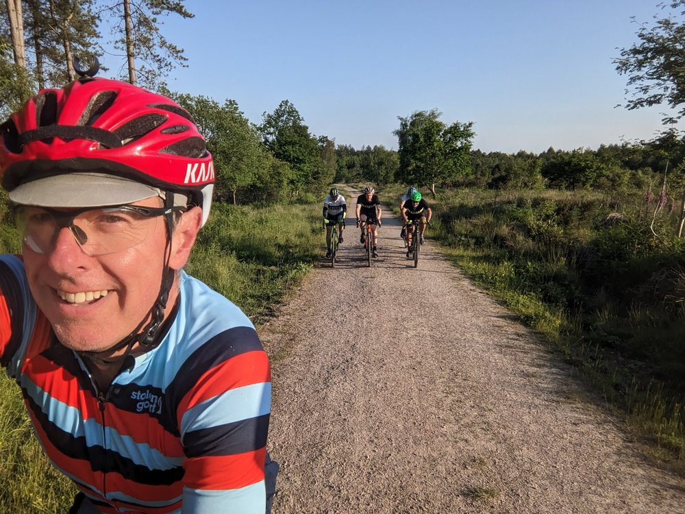
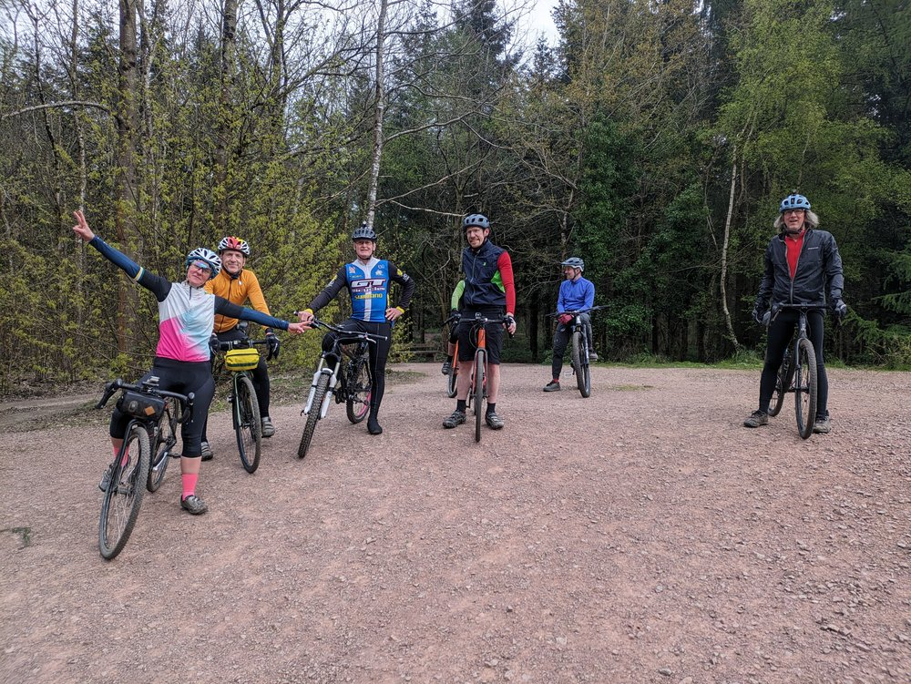

Gravel!

As quite a few people both face to face and online ask what sort of activities we get up as a club I thought I might comment on one of them, the currently trendy GRAVEL. 

Locally we have a large amount of forestry gravel roads, single track, rights of way and even some pretty dodgy tarmac. All of this are ridden under the general theme of gravel. Club members travel nationally to organised events. They take part in organised weekend club rides and regular mid-week outings.  It could be said that this sort of riding is becoming a significant part of the clubs activities. Rides are commonly posted on the clubs Facebook page which then usually is transferred to this website as well. 

Our most popular rides are the Thursday evening rides. It is fair to say that these take place in some form or other on probably 50 weeks of the year. Monsoon conditions just prior to the start time are the only reason for noting to happen. Some of our riders are pretty waterproof! Thursday rides almost always start from The Fountain Inn at Parkend at 18:30 hours. They usually last for a couple of hours and are followed by a similar amount of time rehydrating in the afore mentioned venue.  The routes are variable. Sometimes someone has a route roughly planned. Occasionally this may even be the person who advertises the event but don’t take that for granted. Even more occasionally we may have a themed ride such as WW2 sites or geology of the Forest. 

More commonly it is a case of someone at the start starting the ball (and the bikes) rolling but pedalling off from the car park conversation and the rest following. Usually we then follow sheep like until someone else has a bright idea. The terrain will almost certainly be mixed. Winter usually sees us sticking to the forestry gravel to a great extent but this isn’t universal be it by intent or accident. Filthy single track can appear at any time but is usually short-lived or avoided.  We ride as a group, possibly spreading out slightly on the climbs and any tricky descents but no one is left behind (unless they chose to disappear without telling someone) . The few mechanical problems are dealt with communally with all that that may entail. The only time that the group may split into smaller segments is if there is an easy and fast sprint to the pub. White Gates to The Fountain can get somewhat frantic with the more competitive pushing on, the hopeful trying to hang on and the sensible pootling along a couple of minutes behind. 

Over the years the bikes have evolved along with modern fashion. Most people are on gravel or cyclo-cross bikes with a fair mix of 1x or 2x gearing set ups. One or two people prefer a mountain bike, usually not too downhill orientated and surprisingly mostly still 26” wheeled. From September until April decent front lights are needed and most of us have a helmet mounted spot or back up light as well. Rear lights are not usually used off road and those who persist on having a flashing red lighthouse at the rear are soon reminded. Mudguards are a good idea, be they effective, full road going types or vestigial bits of plastic that allow your mates to get the full blast of your back wheel. They do make you more popular in the (otherwise amazingly tolerant) pub where muddy cushions are frowned upon. 

The gravel rides have proved to be an effective recruitment activity with many of our newer, say post Covid, members coming into the club this way. Newcomers are welcome to come and try us out. We do ask that your bike is up together and you carry the means to fix a puncture or simple mechanical  although no one will be abandoned for the boar to eat.  Like most clubs of all activities we are more than happy for people to tag along for a couple of rides but if they want to continue we ask that they join the club for a reasonable £15.(Discounted throughout January 2025). 

If any newcomer have any questions they can contact the club though the website or ask to join the Facebook page. Please answer the joining questions and mention the gravel rides as well. 