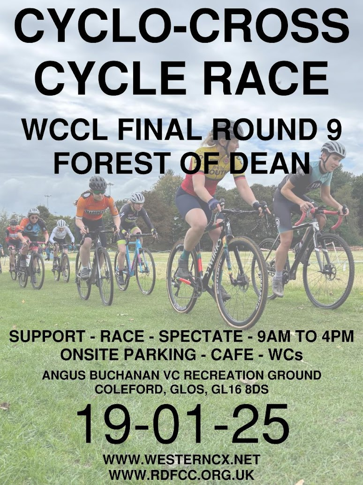

Round 9 of the Western Cyclo-Cross league will be held in the forest on Sunday 19th January 2025

The location is the Angus Buchanan VC Recreation Grounds in Victoria Road, Coleford

<iframe src="https://www.google.com/maps/embed?pb=!1m18!1m12!1m3!1d755.1539984802348!2d-2.6255326827634184!3d51.79308404933551!2m3!1f0!2f0!3f0!3m2!1i1024!2i768!4f13.1!3m3!1m2!1s0x4871ba27f2471539%3A0x7101db4dc270d8a7!2sAngus%20Buchanan%20VC%20Recreation%20Grounds!5e0!3m2!1sen!2suk!4v1736766941041!5m2!1sen!2suk" width="600" height="450" style="border:0;" allowfullscreen="" loading="lazy" referrerpolicy="no-referrer-when-downgrade"></iframe>

To enter the event please visit this <a href="https://www.britishcycling.org.uk/events/details/307307/Western-Cyclo-Cross-League-Round-9---Forest-of-Dean---Winter-20242025-Season" target="_blank">link</a>

The schedule for the day is as follows:

<table><thead><tr><th>Sighting (course is open)</th><th>Race (only race cat riding)</th><th>Category</th></tr></thead><tbody><tr><td>0900</td><td>0930-0945</td><td>U12, U10, U8 (15 mins)</td></tr><tr><td>0950</td><td>1010-1040</td><td>U16, U14 (30 mins)</td></tr><tr><td>1040</td><td>1110-1150</td><td>V40 and Open Junior (40 mins)</td></tr><tr><td>1150</td><td>1220-1300</td><td>Women (Junior, Senior, Vets) (40 mins)</td></tr><tr><td>1300</td><td>1330-1410</td><td>Open (V50, V60) (40 mins)</td></tr><tr><td>1415</td><td>1445-1545</td><td>Open (Senior and U23) (60 mins)</td></tr></tbody></table>

Spectators very welcome!

To listen to Dan talking on Dean Radio about the event click this <a href="https://www.mixcloud.com/DeanRadio/foresters-talking-sport-6th-jan-2025/" target="_blank">link</a>

