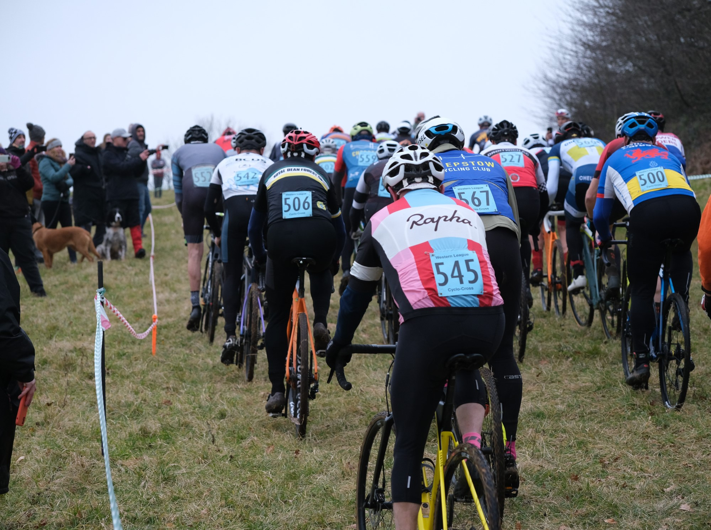
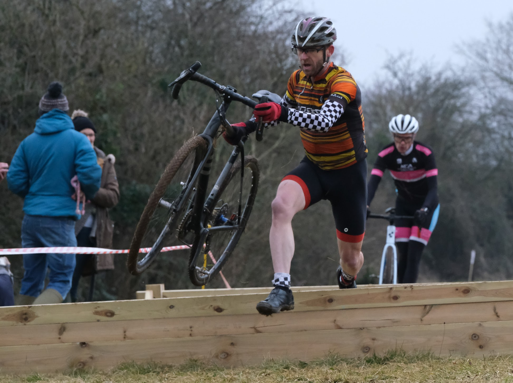
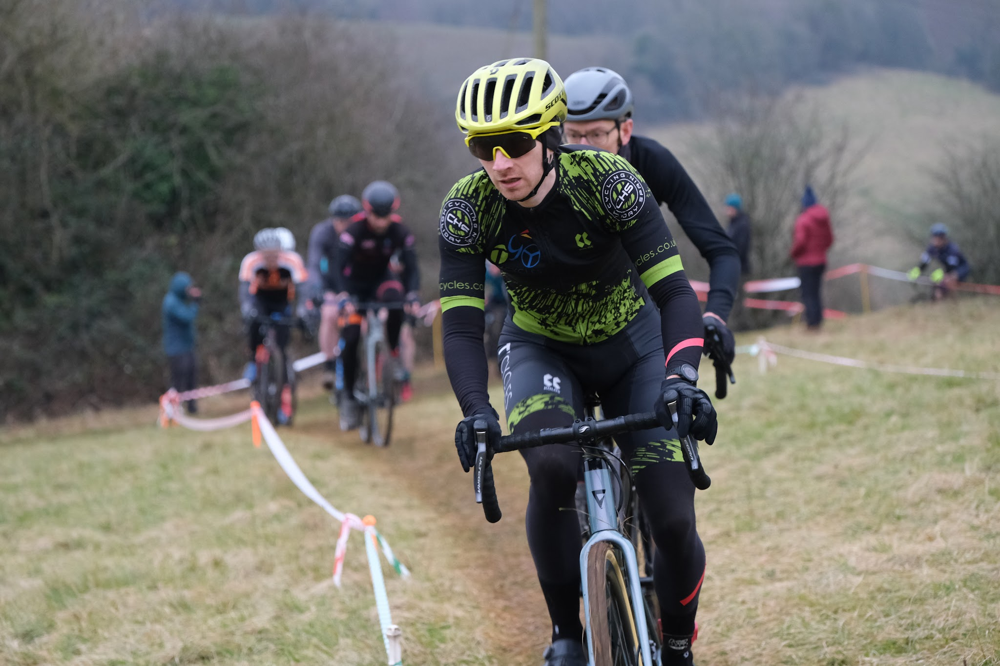

**Forest Cross - January 2025**

We had a fantastic turnout for our first-time Cyclo-cross venue back in January. The weather was fair and stayed dry, so a fantastic and fast days racing was had by over 200 racers, including mountainbike legend Tracy Moseley!

Huge thanks to the Landowner, the Angus Buchanan VC Recreation Ground Trust, appreciation to the Coleford Bowls Club for running the Clubhouse,
and thanks Dean Trail Volunteers for use of their Podium. Also many thanks to all of the helpers and volunteers, without which events like this could not happen.

The club committee has agreed that they want to host another race in future, so watch this space…

