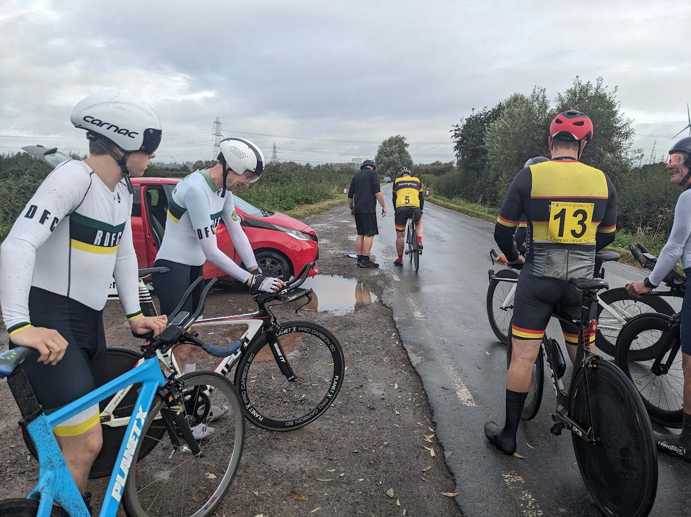

****

Time trials are a long standing and traditional part of British cycle sport and an important element in the success of the Royal Dean Forest Cycling Club. To many, time trials (TT’s) will be seen as part of the big pro tours but they are an important part of club cycling and can be participated in without the glitz, glamour and expense that seems to be required. For the uninitiated a TT’s are a timed race against the clock on a recognised road course. Riders are set of at minute intervals and the lowest time wins. TT’s are said to be the race of truth and supposedly you are only racing yourself. This is true, we all try to improve on personal times but we also want to beat our mates or get a bit closer to an acknowledged faster rider.  Club events are generally held on week day evenings, in the case of the RDFCC  Tuesdays,  on local courses. 

Club TTs are usually fairly short. We run to kilometre sprints, a variety of events based around the 6 miles Cannop/Speech House circuit, a standard distance 10 mile event starting near Lydbrook and a hilly 15 miler with a nasty finish up the Christchurch. This year will also see our hill climb events added to and moved to the traditional hill climb time of the end of the season. 

To take part there are a few essentials. Firsly a bike. It can be any bike (No ebikes though) but common sense says that we don’t want to make life too hard so most people start on their road bike. A gravel bike will be fine although hefty tyres will slow you down. It doesn’t matter first time out though. You don’t need an expensive TT bike although some people do move on to them. If you are a front runner you may wish to gain small advantages with a specialist TT bike or if you are facing old age and poor fitness ungracefully (like me) you may wish to buy a bit of speed. If you get hooked you can create a dedicated bike pretty cheaply now that rim braked bikes are becoming less popular and thus sold cheaply. 

The best way to get faster is to get fitter. This can be irritating and hard work so some of us concentrate on the other way to get fast. Get aero. Don’t wear baggy clothing, get as low and narrow as you can, maybe ditch the bottles and tool bag for the race etc. Maybe this is where your dedicated bike starts to look attractive. Bolt on TT bars are an easy improvement and can make a difference. Don’t worry to start with though. Our usual event winners are often those on their every day road bikes. 

 There are a couple of other essentials. These are non-negotiable and are required by our governing body, Cycling Time Trials (CTT).  You must  wear a helmet and you must have front and rear lights. You must also be a paid up member of a CTT affiliated club and if we do not know you, you will be asked to prove this. If in doubt ask or join us, ideally in advance as dealing with new members on the night is less than ideal. 

Our club TTs usually start at 7pm although the last few hill climbs will start at 6:30pm. Please be at the start/meeting point 30 minutes before the start to sign on and if you haven’t ridden with us before to get entered onto our timing data base. Entry fees are small, £4 and in cash. Try to bring the right money as change isn’t always there! Sign on, there will be a clip board being passed around, chuck your money in the tub and wait to be assigned a number. This is usually done according to prior times and new comers will be given an early number unless we know you are fast. I reckon that our time keeper would give Geraint Thomas a low number if he didn’t mention who he was. Numbers are handed out and are pinned on your back. Ask for help if you want. A line of lycra clad riders all bent over in a line fiddling around with safety pins near the person in front’s back side surely must be disturbing for passers-by.  There is a good chance that you can find a car to dump spare clothing in if you have ridden to the event but it cannot be guaranteed. 

We now wander off to the start which maybe at the same place or it maybe up the road a bit. You’ll be called to the line, probably offered a push off and a countdown begins . Off you go. It pays to have worked out the route beforehand, just ask, and if we have to turn around or not. Go like hell! Take care with other road users and assume that they are out to get you. If you catch the person in front you cannot sit on their wheel getting a tow. You have to pass cleanly and carefully. It’s worth a shout as a warning. When you get to the finish shout your number as you pass the time keeper and roll on up the road to keep out of others way. Times will be calculated when every one has finished and will be there for you to check in a few minutes. Our regular time keeper is very good at all of this but don’t hassle him. 
That’s it, done. You’ll be hooked. TTs are a very friendly part of cycle sport. We all have our own targets and everyone is welcomed and applauded. If you don’t want to try things straight away just come along to the start and watch. The event calendar is posted on the club website and on our Facebook page which is worth checking in case there any last minute changes. Results will appear here as well. 

Come and join us.

