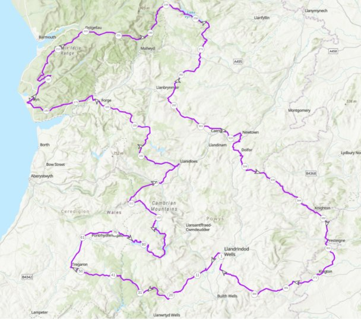
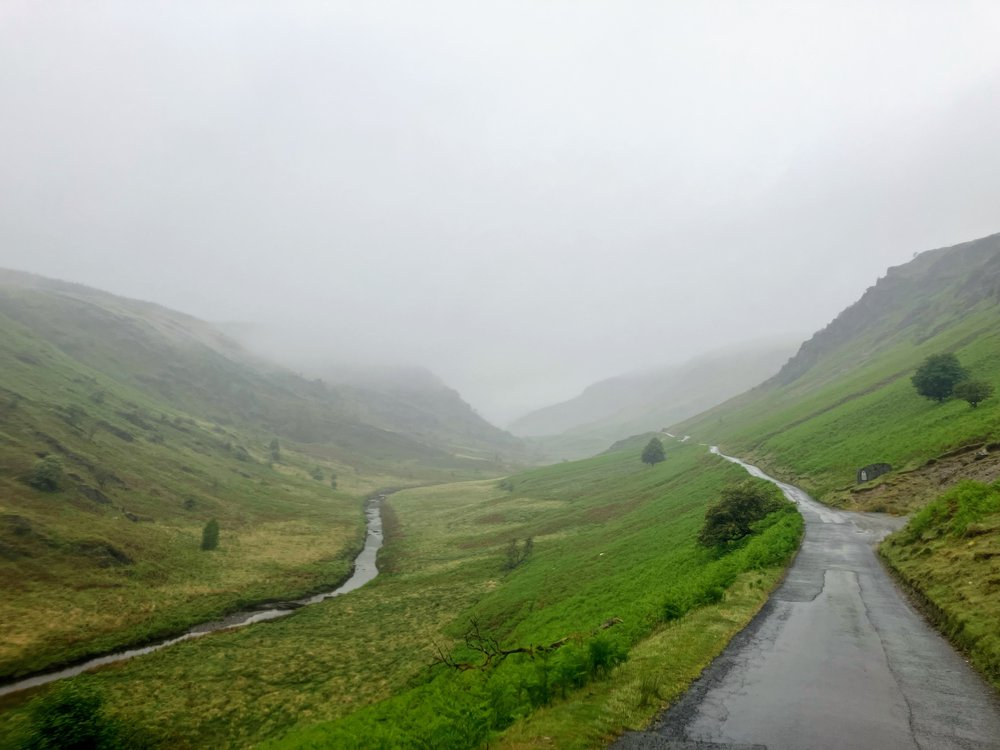
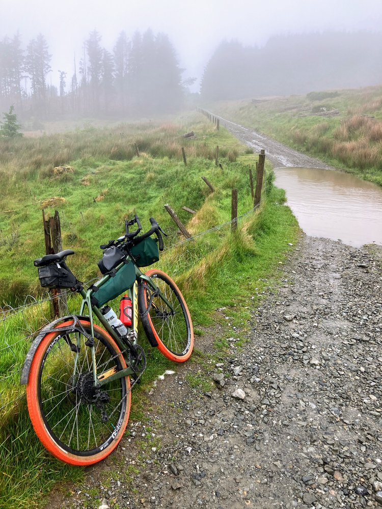
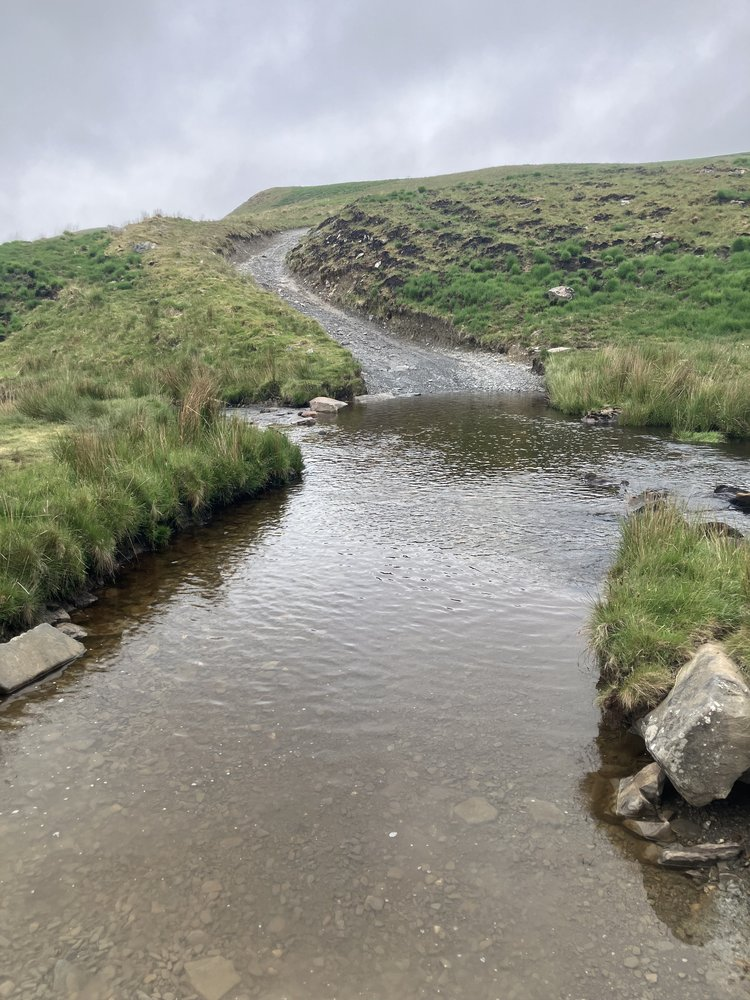
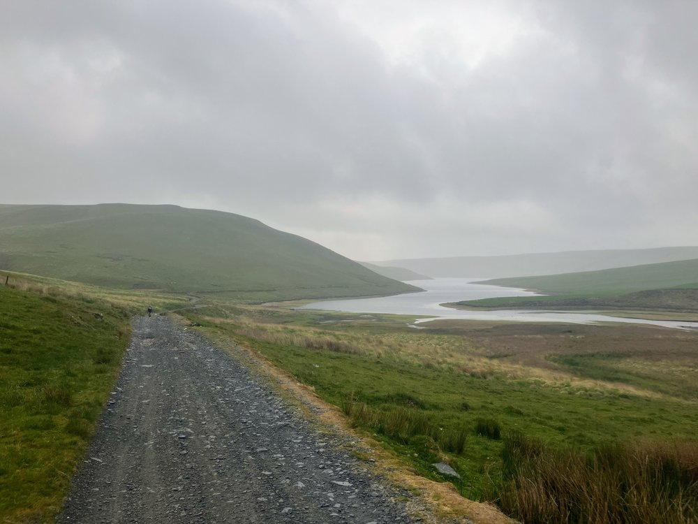
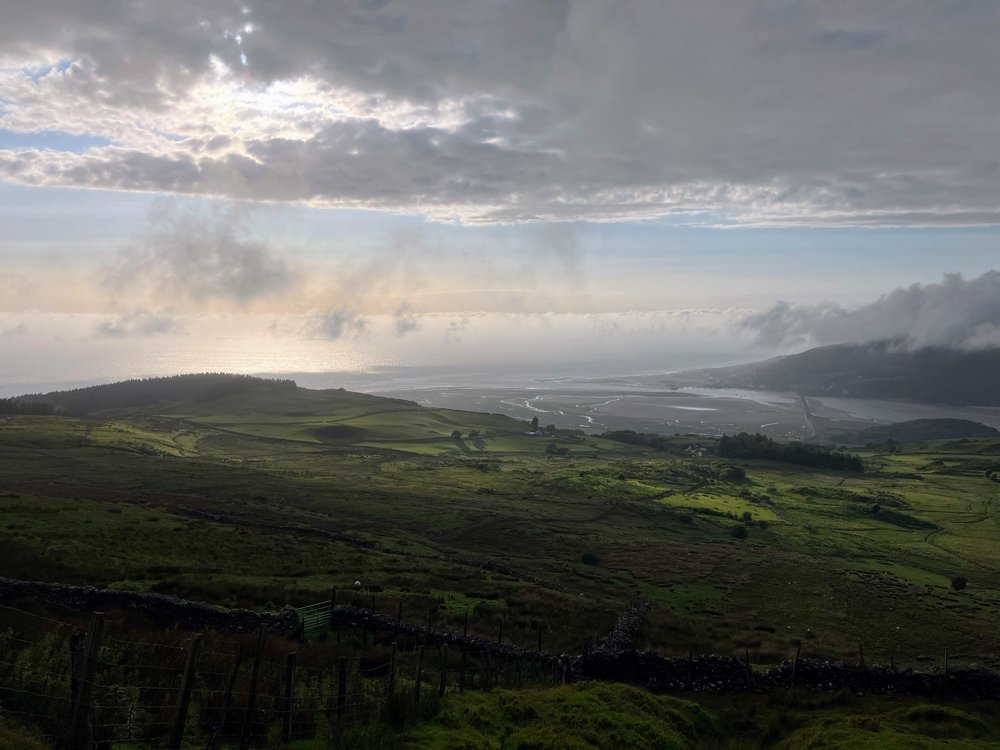
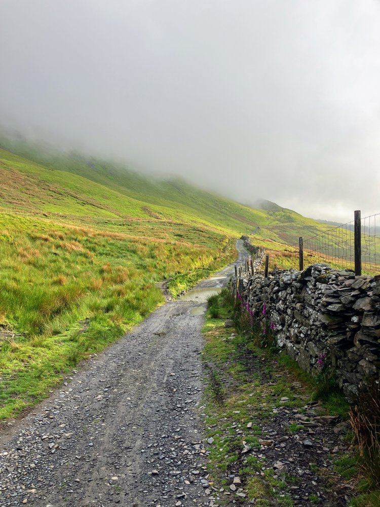

Audax riding - TINAT400 - This Is Not A Tour - May 2025

A lap of much of mid Wales organised by Mark Rigby in memory of the ultra distance cyclist
Mike Hall who rode these roads regularly.

The ride was my attempt at the 400km distance, and therefore the first time for riding a day and
night straight through. I’d decided when I entered that there would be no time for sleeping! The
‘delightful’ combination of the distance, the hills (all 7500m of them as it turned out), the three
sections of not tarmac, and the 28hour time limit left little time for anything but riding riding
riding!

Five from the club had entered the weekend’s TINAT rides myself, Rich and Jon on the 400km,
and Emily and Michelle taking the 200km route with its lure of sunshine at the seaside. We all
rode our own pace although Rich and I would meet up throughout the route.

The claggy skies from the start at Llandrindod Wells hid any chance of early sun, but did
obscure the extent of the initial climbing over the Devils Staircase and through to Tregaron.
Views improved after that as we hit the gravel and river crossing alongside Claerwen Reservoir.
Rich showing some impressive balancing skills on the stepping stones whilst I paddled through -
neither of us wanting to immerse the bikes in the water. 

On through the Elan Valley, and over the Rhayader mountain road into the Cwmystwyth valley led us to the novelty of the ‘Mohican
road’. A rough track up the side of the valley with a singletrack strip of tarmac down the middle.
Just about rideable, with a degree of focus to keep the wheels in line. More steep hills to
Llanidloes followed, and with barely 100km done I was in need of proper food. Double sausage
rolls and chocolate cake in Llandiloes ticked that requirement, and then onto Machynlleth and
the Happy Valley road to Twywn. 

Fish and chips in Twywn as Rich and I watched the rain
clouds circle. Then back up into the clouds for the final section of gravel between the summit of
Cadair Idris and the sands of the Mawddach estuary, heading for Dolgellau. The initial tarmac
section was totally clagged out and felt very peaceful. The gravel beyond that was excellent and
challenging. The clouds tore away at times to reveal the great views to the Mawddach estuary
and coast, and the mix of water and sections of deep gravel kept things focused!

Dolgellau was just over halfway and felt like the turning point of the ride into the nighttime
section. Sunset found me somewhere up the Hirnant Pass above Llyn Bala, with Rich’s rear
light blinking away above me, and aiming for the next control at the only shop at Dafarn Newydd
at the end of Llyn Vyrnwy. Brilliantly the shop had stayed open for the event, and the hot coffee
and hot sausage bap at almost midnight won’t be forgotten for a while. And certainly a world
away from the subsequent stop in a busy neon lit McDonalds in Newtown for water at 3am.
Less than 100km to go from there, and still within the time limit. My screeching brakes helped
keep me (and probably many local residents) awake, and the rain held off through the night.

Sunrise by 5am warmed us up a bit, as did the truly savage tarmac/gravel/grass/rock climb and
descent to Presteinge. 3hours for 30km became 2 and a ¼ hours for 20km, and 1 and a ½
hours for 10km. I’ve got this!

Finished with just under an hour left. An excellent day and night of riding, and a great
experience.