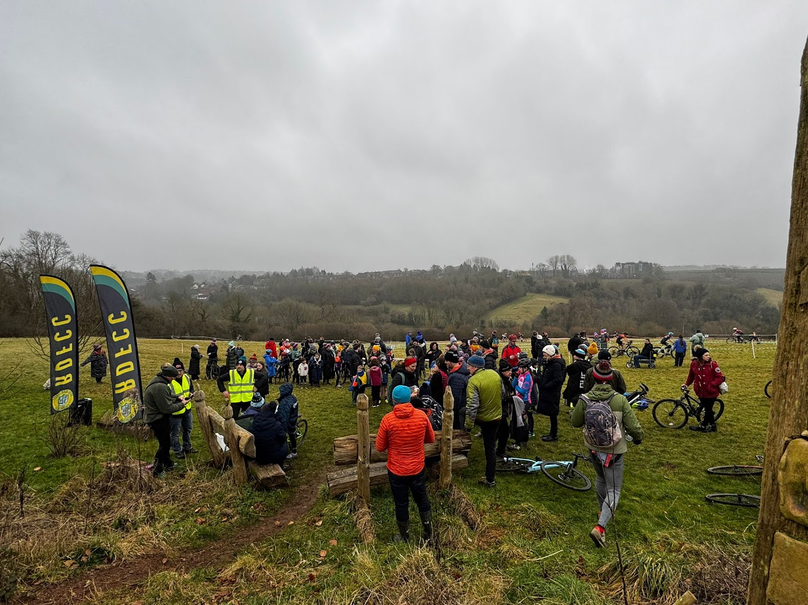

We’re thrilled to announce that RDFCC will once again host a British Cycling-affiliated cyclocross event—the tenth and final round of the Western Cyclocross League’s 2025/26 season!

Mark your calendars for Sunday, 18th January 2026, when the racing action unfolds at the scenic and undulating Angus Buchanan VC Recreation Ground in Coleford, Forest of Dean.

The venue offers excellent facilities, including ample parking, a clubhouse with proper toilets, and a café serving hot drinks and food to keep riders and spectators fueled. Plus, it’s just a short distance from Coleford town, where visitors can find all the amenities they might need.

Course Highlights:

Kids: A more approachable route featuring gentler climbs, extra obstacles, and a short section of singletrack for added fun.

Adults: Expect a dynamic mix of speed, technical challenges, and a demanding stretch of wooded singletrack for those who love a test!

We extend our sincere thanks to the Angus Buchanan Trust for granting use of their grounds, Coleford Bowling Club for access to their clubhouse, the Western League Committee for their planning support, and British Cycling for event homologation.

We can’t wait to see you there! CROSS IS COMING

The location of the Angus Buchanan VC Recreation Grounds in Victoria Road, Coleford

<iframe src="https://www.google.com/maps/embed?pb=!1m18!1m12!1m3!1d4150.139972041816!2d-2.6239390612504327!3d51.7935884650936!2m3!1f0!2f0!3f0!3m2!1i1024!2i768!4f13.1!3m3!1m2!1s0x4871ba27f2471539%3A0x7101db4dc270d8a7!2sAngus%20Buchanan%20VC%20Recreation%20Grounds!5e0!3m2!1sen!2suk!4v1765369990346!5m2!1sen!2suk" width="600" height="450" style="border:0;" allowfullscreen="" loading="lazy" referrerpolicy="no-referrer-when-downgrade"></iframe>

To enter the event please visit this <a href="https://www.britishcycling.org.uk/events/details/326022/Western-Cyclo-cross-League-Round-11---Forest-of-Dean---Winter-20252026" target="_blank">link</a>

One the day entry will also be available via cash or card.

The schedule for the day is as follows:

<table><thead><tr><th>Sighting (course is open)</th><th>Race (only race cat riding)</th><th>Category</th></tr></thead><tbody><tr><td>0900</td><td>0930-0945</td><td>U12, U10, U8 (15 mins)</td></tr><tr><td>0950</td><td>1010-1040</td><td>U16, U14 (30 mins)</td></tr><tr><td>1040</td><td>1110-1150</td><td>V40 and Open Junior (40 mins)</td></tr><tr><td>1150</td><td>1220-1300</td><td>Women (Junior, Senior, Vets) (40 mins)</td></tr><tr><td>1300</td><td>1330-1410</td><td>Open (V50, V60) (40 mins)</td></tr><tr><td>1415</td><td>1445-1545</td><td>Open (Senior and U23) (60 mins)</td></tr></tbody></table>

Spectators very welcome!

<a href="https://westerncx.net" target="_blank">Western CX</a>

