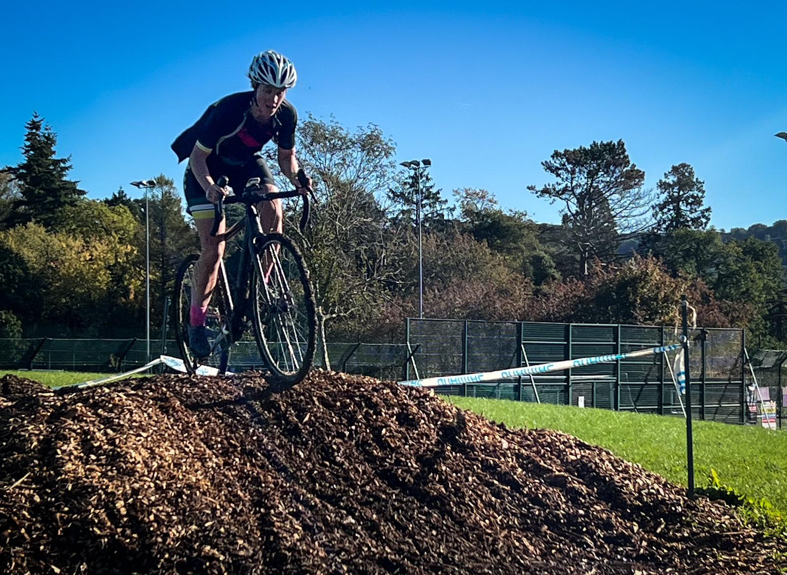
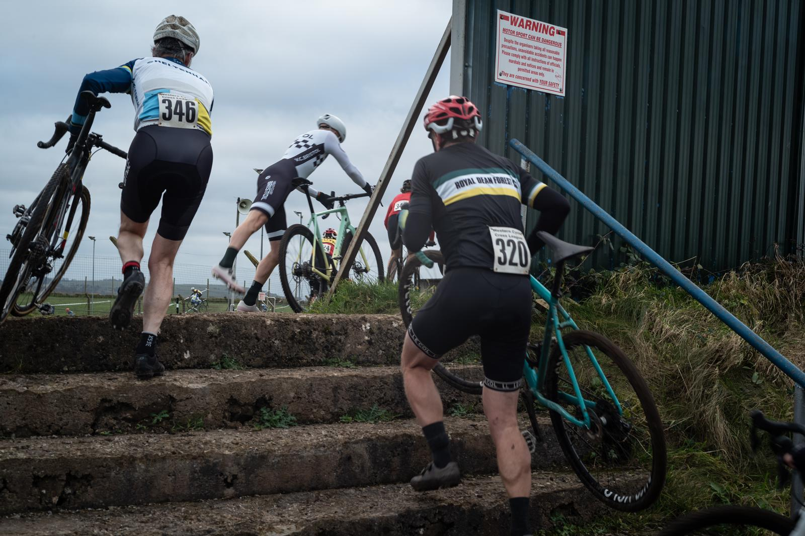

2023 saw an active return for the club racing cyclocross. Four members regularly raced covering ten races in the Weston Cyclocross league along with races in the Welsh league and Hellcross in Belgium.

The  season started at Pitville Park Cheltenham, typically a dry, fast and enjoyable race. A grounding of how hard cyclocross is and unfit you are!

Netham Park in Bristol was the next round, an even faster course, but still dry, A crash on the start line was narrowly avoided by Jon and James, however James retired but Jon went on to finish strongly. 

Stroud was the first race where the mud first appeared and followed us for the rest of the Season.
We are lucky to live in the Forest of Dean as not only  do we compete in the Weston League, when there are no races on we are able to go across the border to race. Pontypool was bitterly cold, James punctured on lap one, Emily however managed to finish second, she also podiumed later on at Upton Chevney.

Shamcross, the Regional Championships, was a miserable affair with thick mud that clung to everything This is where _Dynamo Dan_ got his nickname from, after racing on the most inappropriate tyres! Also this is where he became the clubs top Heckler.

James went back to Belgium to race at the last ever Hellcross. Hellcross isn’t your usual Cyclocross race, it has jumps, beer stops and the infamous caravan to ride through with a band playing on the roof!

Sadly the season was cut short due to the prolonged wet weather, the last race run was at the Mendips raceway, a varid and entertaining course to say the least. 

The 2024/25 season starts in September, feel free to join us as we again will race as many events over the winter, a great way to keep your fitness up.